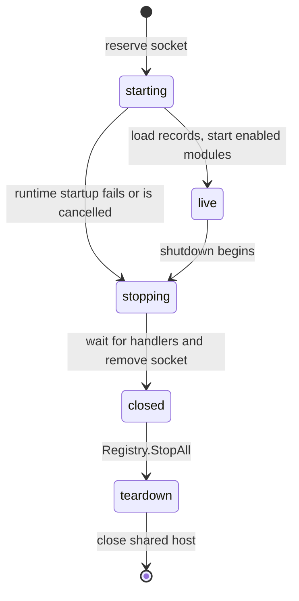
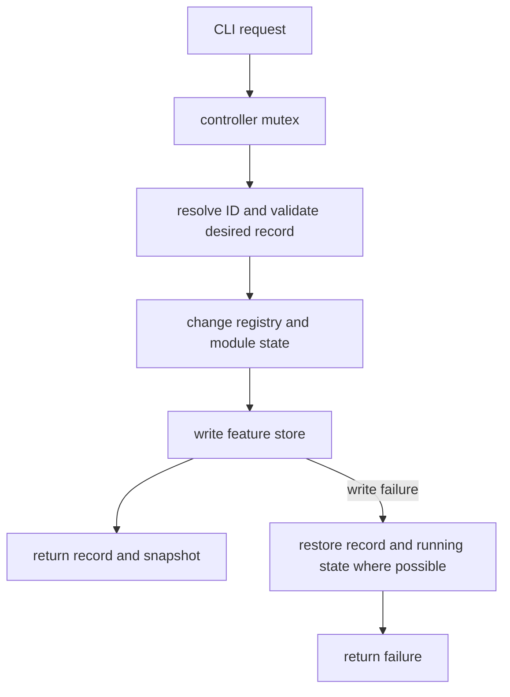

# Control-plane contract

[Documentation index](../README.md)

Use this page when changing feature CRUD, the runtime socket, or the boundary between persisted desired state and live module state.

`phonelink-linux run` exposes feature CRUD to the CLI through a Unix domain socket. The implementation is in [`runtime/controlplane`](../../runtime/controlplane), and the runtime handler is [`cmd/phonelink-linux/runtime_control.go`](../../cmd/phonelink-linux/runtime_control.go). The socket controls the local feature registry only. It is not the Microsoft or Hub Relay protocol.

## Socket identity and permissions

The socket path is derived from the cleaned absolute feature-store path. The runtime takes the first 12 bytes of SHA-256, writes them as a 24-character hexadecimal name, and appends `.sock`:

```text
$XDG_RUNTIME_DIR/phonelink-linux/<24-hex-store-hash>.sock
```

If `XDG_RUNTIME_DIR` is empty or the candidate path reaches the implementation's 100-byte path budget, it uses:

```text
/tmp/phonelink-linux-<uid>/<24-hex-store-hash>.sock
```

The server creates the parent directory with mode `0700` and the socket with mode `0600`. It accepts at most 16 concurrent clients and limits each JSON request to 1 MiB. These permissions provide local-user access control. The protocol has no remote listener or authentication layer, so it must not be moved to a shared path without a new security design.

On listen, an existing path is probed with a version 1 `list` request. A responding runtime produces `runtime already running`; an unavailable path is treated as stale and removed. This prevents two live runtimes from owning the same store. `Server.Close` waits for active handlers and removes its socket.

## Version 1 wire format

Requests and responses are one JSON object per connection, terminated by the JSON encoder's newline. The request decoder rejects unknown fields and the response decoder used by the CLI also rejects unknown fields. `version` must be `1`.

### Request fields

| Field | Type | Required for |
| --- | --- | --- |
| `version` | integer, `1` | Every request. |
| `operation` | string | One of `list`, `get`, `create`, `update`, or `delete`. |
| `id` | string | `get`, `update`, and `delete`. |
| `record` | feature record | `create`; contains the feature ID, enabled flag, and config object. |
| `enabled` | boolean | An optional desired-state change in `update`. |
| `config` | JSON object | An optional whole-configuration replacement in `update`. |

For example, a create request:

```json
{
  "version": 1,
  "operation": "create",
  "record": {
    "id": "phonelink.clipboard",
    "enabled": true,
    "config": {}
  }
}
```

Fields other than `version` and `operation` are optional in JSON but required as appropriate for the selected operation. The CLI requires an update to supply `enabled`, `config`, or both. Feature configuration is checked by the feature's Go validator.

### Response fields

| Field | Meaning |
| --- | --- |
| `version` | Protocol version, `1`. |
| `ok` | Whether the request succeeded. |
| `error` | Human-readable failure message when present. |
| `record` / `records` | One persisted feature record or the persisted list. |
| `snapshot` / `snapshots` | One live kernel snapshot or the live list. |

Empty optional fields are omitted. For example, a successful `get` response for a ready clipboard entry:

```json
{
  "version": 1,
  "ok": true,
  "record": {
    "id": "phonelink.clipboard",
    "enabled": true,
    "config": {}
  },
  "snapshot": {
    "id": "phonelink.clipboard",
    "version": "0.1.0",
    "enabled": true,
    "state": "ready",
    "config": {},
    "epoch": 1
  }
}
```

`ok: false` carries a human-readable `error`. `list` returns both `records` from persistence and `snapshots` from the live kernel. `get` returns whichever persisted record and live snapshot exist. A stale record with no current implementation can therefore still be inspected.

The server returns a failure for a malformed or oversized request, an incompatible version, an unknown operation, or a handler panic. A panic is isolated to that connection and does not terminate the server. The client gives calls a five-second default timeout and maps a missing socket, refused connection, or non-socket path to `runtime unavailable`. Live mutations have a fifteen-second runtime budget, so a client timeout does not prove that the mutation was rolled back; inspect `feature get` or `feature list` after reconnecting.

## Startup and live handler switching

The runtime reserves the socket before opening the Phone Link host. At this point the switch handler returns:

```text
runtime is starting; retry the feature command
```

The lifecycle of that one socket is:



The CLI treats a live response error as authoritative. It does not fall back to offline store edits after connecting to a runtime that rejects a mutation. After feature records load and enabled modules start, the runtime swaps in the live controller without replacing the socket. During shutdown it switches to:

```text
runtime is stopping
```

The server closes before registry teardown and waits for in-flight handlers. Their contexts inherit the runtime context, so a shutdown cancellation can end a pending lifecycle or network wait. The registry then executes reverse actual start-order teardown. This ordering prevents a CLI mutation from racing capability revocation or module stop.

## Reconciliation semantics

`runtimeController` serializes all requests with one mutex and applies a fifteen-second mutation timeout. It holds the store and kernel as separate representations of the same desired feature state. Persistence is authoritative when the daemon is offline; while the daemon is live, the controller owns the mutation path.

A live mutation follows this order:



### Create

The controller resolves the ID from the builtin catalog, validates configuration, confirms that persistence has no record, builds and registers a module, and starts it if `enabled` is true. It writes the record only after runtime setup succeeds. If the store write fails, it deletes the runtime entry and stops any started instance.

### Update, enable, and disable

The controller reads the existing record, calculates the desired enabled flag and configuration, and resolves the implementation. For an unavailable ID it allows only a disable-style update. Enabling or changing configuration is rejected because there is no module to validate or run.

For an available module, a running instance is stopped first. The kernel validates the new configuration and updates the entry. An enabled desired state starts a replacement instance. Only after that runtime transition succeeds does the controller write the feature store. A write failure invokes rollback: stop the changed instance, restore the old record and configuration, and restart the old instance if it had been running. The returned snapshot exposes the replacement epoch.

The CLI commands are:

```bash
go run ./cmd/phonelink-linux feature list --state ~/.config/phonelink-linux/features.json
go run ./cmd/phonelink-linux feature get --state ~/.config/phonelink-linux/features.json phonelink.clipboard
go run ./cmd/phonelink-linux feature create --state ~/.config/phonelink-linux/features.json --enabled phonelink.clipboard
go run ./cmd/phonelink-linux feature update --state ~/.config/phonelink-linux/features.json --config '{"poll_interval_ms":250}' phonelink.clipboard
go run ./cmd/phonelink-linux feature disable --state ~/.config/phonelink-linux/features.json phonelink.clipboard
go run ./cmd/phonelink-linux feature enable --state ~/.config/phonelink-linux/features.json phonelink.clipboard
go run ./cmd/phonelink-linux feature delete --state ~/.config/phonelink-linux/features.json phonelink.clipboard
```

Flags precede the positional feature ID because the Go flag parser stops at the first positional argument.

### Delete

Delete first stops and removes the registry entry, revokes capabilities, and removes the start-order record. It then deletes persistence. If persistence deletion fails, the controller rebuilds the module from the catalog and restores its previous enabled state. A stale record with no implementation has no registry entry, so it can still be deleted offline or through the live controller without rebuilding a module.

## Offline mode

If the socket is unavailable, `feature` commands open the feature store and perform desired-state CRUD directly. Offline operations do not authenticate with Microsoft, open a relay, build a feature instance, or report a live state or epoch. They validate only the catalog and feature-store contracts available to the CLI.

The CLI still resolves known definitions for list and get. It prints unknown persisted IDs as installed records. `feature disable` and `feature delete` can clean up stale records. `feature enable` and configuration updates require an implementation in the current catalog.

## Observable invariant tests

The protocol and reconciliation contract is exercised by:

- `runtime/controlplane/controlplane_test.go`, which checks JSON round trips, version handling, socket modes, stale-path replacement, scoped and short fallback paths, startup and shutdown handler transitions, client unavailability, bounded handler behavior, and panic isolation;
- `cmd/phonelink-linux/feature_test.go`, which checks offline CRUD, stale-record cleanup, and the rule that a connected runtime rejection never falls back to mutating persistence;
- `runtime/kernel/registry_test.go`, which checks dependency ordering, epochs, stale errors, provider teardown protection, transitive degradation, stale start rollback, and stopped update state;
- `runtime/kernel/store_test.go`, which checks persistence across reopen, duplicate detection, object configuration checks, and deletion.

Dated production reports cover live `list/get`, disable, enable, config restart, delete, and create while one runtime remained connected to the same S23. Those reports do not prove long-running reconnect, wake, or token-refresh resilience. See the [validation research](../research/validation.md) for the reported environment and limits.
