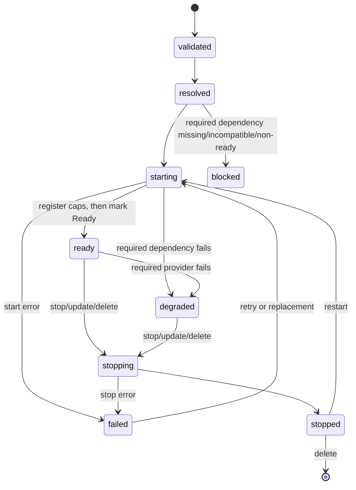
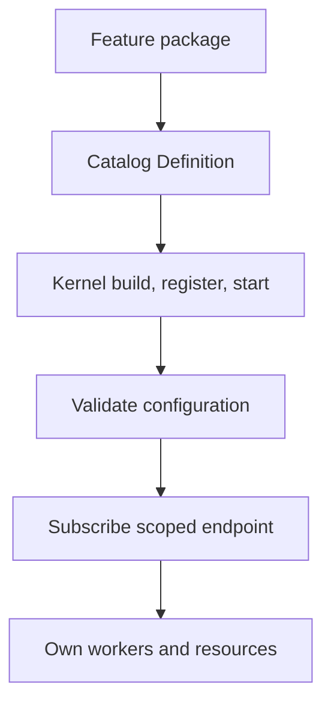

# Module architecture

[Documentation index](../README.md)

Use this page when you are adding, changing, or removing a builtin. It covers the manifest and configuration contract, lifecycle states, dependency rules, capability publication, and the ownership expected from a feature package.

The feature runtime is an in-process registry around a small, business-agnostic kernel. The only shipped definition is `phonelink.clipboard`, registered by [`features/catalog.go`](../../features/catalog.go). A feature package owns its domain behavior. The kernel must not gain feature-specific routes, and feature packages must not import one another directly.

## Contract at a glance

| Concern | Owner | Entry point |
| --- | --- | --- |
| Manifest shape and strict parsing | Kernel plus the versioned schema | [`contracts/manifests/phonelink-feature.schema.json`](../../contracts/manifests/phonelink-feature.schema.json), `runtime/kernel/manifest.go` |
| Feature-specific configuration | Feature package | Clipboard [`config.schema.json`](../../features/clipboard/config.schema.json) and `DecodeConfig` |
| Desired state | `runtime/kernel.FeatureStore` | `~/.config/phonelink-linux/features.json` |
| Lifecycle and dependencies | `runtime/kernel` | Registry entry operation mutex and epoch |
| Live capabilities | Kernel capability registry | Registered only during successful startup |
| Domain protocol and native resources | Feature package | `features/clipboard` is the concrete pattern |

## Manifest and configuration contracts

The canonical manifest schema is [`contracts/manifests/phonelink-feature.schema.json`](../../contracts/manifests/phonelink-feature.schema.json). Runtime parsing is stricter than a permissive JSON decode: `runtime/kernel/manifest.go` rejects unknown fields, trailing JSON, an empty or oversized document, unsafe configuration-schema paths, duplicate declarations, invalid identifiers and semver values, incomplete metadata, and an incompatible runtime API.

Manifest schema version and runtime API version are both `1.0`. A valid manifest has:

- a dotted lowercase module ID, semantic version, and `kind: "builtin"`;
- `runtime.api_version`;
- potential capability IDs with contract versions;
- required and optional module dependencies with minimum versions;
- requested permission IDs;
- a relative configuration schema path or `null`;
- display name, description, and diagnostic label metadata.

The parser accepts only builtin modules in runtime API 1.0. There is no process loader, ABI bridge, sandbox, or permission enforcement. `permissions.requested` records intent and ownership metadata. It is not an authorization grant and must not be used as proof that a module can access a resource.

`configuration_schema` is a manifest contract and safe relative path, not a generic runtime validator. The catalog supplies the Go validator that the module owns. The clipboard module's [`config.schema.json`](../../features/clipboard/config.schema.json) and `DecodeConfig` agree on an object with no unknown fields:

- `poll_interval_ms`, integer from 50 through 60000, used only by polling fallback;
- `request_timeout_ms`, integer from 100 through 120000;
- `publish_initial`, boolean, default false.

An empty configuration is normalized to `{}` and receives module defaults. The feature store requires a non-null JSON object and rejects trailing JSON; it does not know feature-specific fields or ranges. The clipboard module's Go validator rejects unknown fields and out-of-range values. Its JSON schema documents the same shape, but is not evaluated by a generic runtime schema engine.

Potential capabilities are declarations only. A successful start registers the instance's live capabilities and marks its registry entry `ready`. Stop, failure, dependency degradation, and rollback revoke them. The clipboard instance returns `clipboard.text.read`, `clipboard.text.write`, and `clipboard.text.bidirectional`, each with contract `1.0.0`.

Capability registration happens before the state becomes `ready`, and the capability and module registries use separate locks. Their snapshots are not atomic together. [INFERENCE] A direct concurrent capability reader can observe registration before the Ready transition, or before a stale-start check removes the provider. Do not infer an atomically Ready module state from a capability-only lookup. See [`start ordering`](../../runtime/kernel/registry.go#L375-L408) and [`capability synchronization`](../../runtime/kernel/capability.go#L25-L83).

## Desired state and lifecycle

`runtime/kernel.FeatureStore` persists records in a version 1 JSON object:

```json
{
  "schema_version": 1,
  "features": [
    {
      "id": "phonelink.clipboard",
      "enabled": true,
      "config": {}
    }
  ]
}
```

The default path is `~/.config/phonelink-linux/features.json`. The store rejects unknown top-level fields, duplicate IDs, invalid IDs, non-object or trailing configuration JSON, and unsupported schema versions. Saves create a `0600` temporary file in a `0700` directory, flush the file, and rename it into place. Store mutations restore the in-memory record if the file save fails.

A registry entry carries the desired enabled state, validated configuration, manifest version, current state, last error, live instance, and an epoch. The lifecycle states are:

| Path | Result |
| --- | --- |
| Successful start | `validated` → `resolved` → `starting` → `ready`. Capability registration precedes Ready and uses a separate lock. |
| Missing required provider | `blocked` until a compatible, ready dependency is available. |
| Start error | `failed`, with a diagnostic. |
| Required provider failure | Active dependents become `degraded`. If failure occurs during Start, invalidate the epoch and stop the returned stale instance as rollback. |
| Stop | Revoke capabilities before invoking `Stop`; finish `stopped`, or `failed` if stop returns an error. |

<details>
<summary>Lifecycle state chart</summary>



</details>

The implementation enforces these rules:

1. Create validates the manifest and configuration before adding an entry.
2. Start, stop, update, and delete for an entry are serialized by that entry's operation mutex.
3. `StartEnabled` repeats dependency resolution until all enabled entries start or no progress is possible. Required providers must be `ready`, have a compatible major version, and satisfy the declared minimum version. Missing, incompatible, or non-ready providers block dependents. Optional dependencies do not block start.
4. Each start attempt advances the entry epoch. A completion or error from an older epoch cannot mutate a replacement instance.
5. A provider cannot be stopped or deleted while a required dependent is live, starting, or stopping. `StopAll` uses the actual reverse start order and does not enforce this rejection because it is the teardown path.
6. `Stop` removes live capabilities before invoking the instance's stop method. Stop is idempotent for an instance. A stop error moves the entry to `failed` with its diagnostic.
7. An instance error moves the current entry to `failed`, revokes its capabilities, reports a runtime error, and transitively degrades active required dependents. A stale instance error is ignored.
8. If a dependency fails while a dependent is in `Start`, the dependent epoch is invalidated. The returned instance is stopped as rollback and never becomes discoverable as `ready`.
9. A bounded registry error channel drops additional errors when full. Feature receive and work queues have their own explicit overflow behavior described below.

A delete removes the registry entry and capabilities after stopping it. Reusing the same ID after deletion creates a new entry whose first successful start has epoch 1. Restarting an existing entry increments its epoch instead.

### Snapshot and race cautions

The capability map and module registry are separately synchronized. A reader that needs a coherent lifecycle answer should read the kernel snapshot, not infer `ready` from a capability lookup. This is an intentional race boundary in runtime API 1.0, not an atomic combined snapshot.

Clipboard publication snapshots have their own bounded lifetime. Snapshots last two minutes and are capped at 64 entries. Evicted or expired correlations are retained as retired IDs, capped at 256 entries with no time expiry. A duplicate CONTENT request does not retire an active snapshot. An unknown correlation may fall back to current local text only when it is not retired or superseded. These rules prevent a late request from receiving unrelated current text, while keeping memory bounded.

## Clipboard module ownership

`features/clipboard` is the concrete extension. `Module.Start` validates configuration, detects a native local text backend, reads the initial local text, subscribes to `phonehost.Session` with a narrow target and PLATFORM matcher, starts the protocol client and publisher worker, sends `FEATURE_ON`, optionally publishes the initial text, and starts the instance run loop. It does not read `transport/relay.Client.Received()` directly.

The module owns:

- the native clipboard observer and writer;
- the `clipboard.Client` protocol client;
- feature-scoped endpoint registration and closure;
- receive, local-observation, and publication workers;
- local and remote generation ordering;
- suppression of reflected phone-to-Linux-to-phone echoes;
- diagnostics and the `FEATURE_OFF` shutdown attempt.

The matcher accepts only PLATFORM messages from the selected target and only the clipboard resource, `/internal/response`, or tag-9 `/Context/Publish` forms. The protocol client owns pending request IDs, published text snapshots, incoming clipboard request dispatch, and a bounded queue of 16 incoming requests. Outbound publication has a one-slot latest-value queue and a bounded result channel. Remote-apply and native-event queues are also latest-value queues rather than unbounded buffers.

Mutable ownership is split deliberately: `transport/relay.Client` serializes DCG sends per peer; `runtime/phonehost.Router` owns the raw receive stream; each feature owns its endpoint queue; `clipboard.Client` owns clipboard request dispatch and the cross-device generation sequence; and `features/clipboard` owns native observation, echo suppression, and watcher fallback. This prevents two layers from concurrently deciding the same ordering or cleanup action.

Local and phone changes share one monotonically increasing generation domain. A phone publication advances the generation and tombstones older versioned local snapshots. A later CONTENT request for a superseded correlation ID is rejected instead of receiving unrelated current text. A newer local event remains eligible after a phone event. Identical phone text is not written again, which prevents a reflected desktop publication from creating an echo.

The origin barrier suppresses both the previous and incoming normalized text hashes for a three-second remote-write settle window. This is echo tracking, not a filter for secret clipboard content.

On Wayland, `wl-paste --watch` supplies local events through the hidden helper in the same executable. A transient `CLIPBOARD_STATE=nil` handoff is debounced before an empty value is observed. A real clear still publishes one empty value. If watching is unsupported or fails, the module uses bounded polling at `poll_interval_ms`; X11 uses polling. Native commands are executed directly without a shell. The module's stop path attempts `FEATURE_OFF` with a short advisory budget, then cancels workers and closes its endpoint even if the phone is unresponsive.

## Adding a builtin

Use the existing clipboard module as the concrete implementation pattern. Build-time composition comes before runtime validation, subscriptions, and resources:

| Phase | Work |
| --- | --- |
| Package | Define the manifest, configuration, validator, factory, and lifecycle. |
| Compose | Add the package's `Definition` to `features/catalog.go`. |
| Start | The kernel builds and starts the module. Validate before opening long-lived resources, then subscribe and own workers. |

<details>
<summary>Builtin composition and startup chart</summary>



</details>

1. Add `features/<id>/manifest.json`, `config.schema.json`, configuration decoding and validation, module lifecycle code, domain protocol or native code, and tests. Keep the ID, configuration, and capability declarations strict.
2. Implement `kernel.Module`: return the parsed manifest, reject invalid configuration before resource allocation, and return an instance with live capabilities, an error channel, and idempotent `Stop`.
3. Subscribe through `phonehost.Session.Subscribe` with the smallest matcher and a documented bounded queue. Own every goroutine, timer, child process, endpoint, and native resource created by the module.
4. Add one `Definition` to `features/catalog.go` with the manifest, marshaled default configuration, validator, and factory. The catalog is the only required build-composition edit.
5. Add tests for the consumer-visible invariants: manifest and config rejection, start and stop ownership, queue overflow or coalescing, capability publication and revocation, and any generation or dependency ordering rule.
6. Create an enabled record and run the runtime only in an environment with the required Microsoft and desktop dependencies. Keep deterministic tests separate from opt-in live smokes.

A feature removal is the reverse cutover:

1. Disable and stop the feature, then confirm its live capabilities and endpoint are gone.
2. Stop dependents before a required provider.
3. Remove the factory entry from `features/catalog.go`.
4. Remove the feature directory and its tests when the implementation is no longer shipped.
5. Leave stale desired-state records readable, disable-able, and delete-able. They cannot be enabled or reconfigured until an implementation with the same ID returns.

The kernel and phone host must remain unchanged for a feature-specific removal. A catalog change is expected because the catalog is composition metadata. There is no supported out-of-process feature path in this runtime API.
