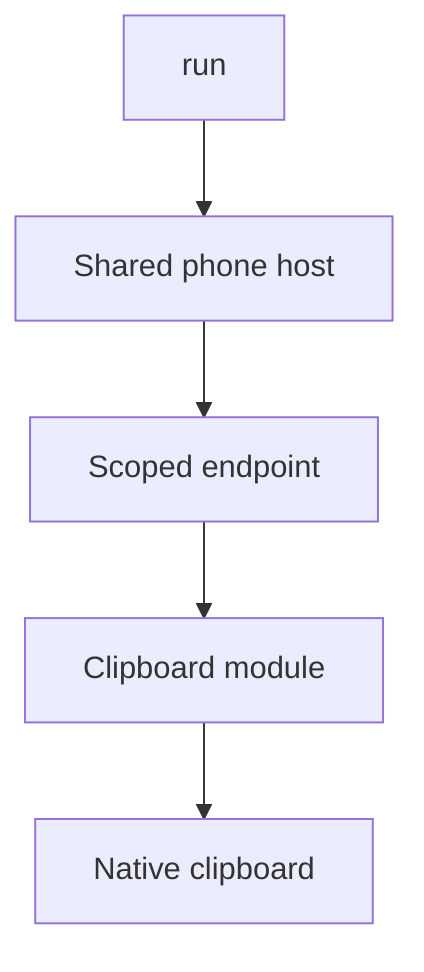
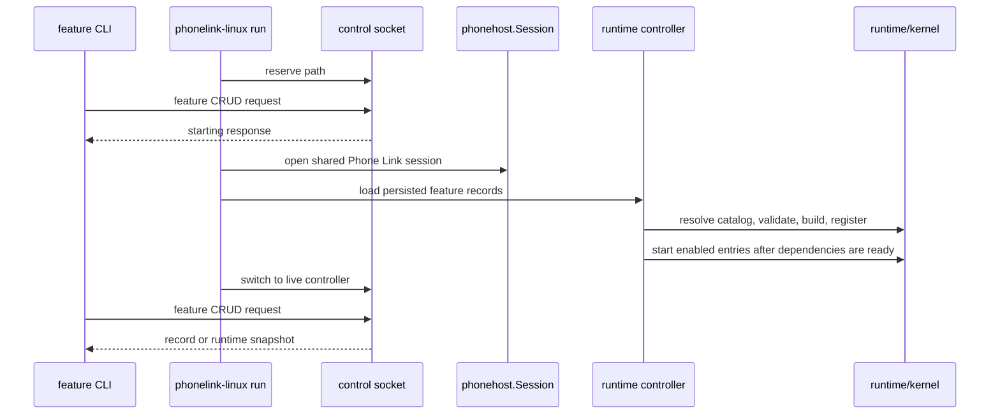

# Architecture overview

[Documentation index](../README.md)

Phone Link Linux is a Go 1.23+ Linux client for Microsoft Phone Link and Link to Windows interoperability. Microsoft cloud services provide authentication, device trust, signed peer wake, SignalR Hub Relay, and the PLATFORM transport. The repository currently ships one built-in feature, `phonelink.clipboard`.

Use this page to answer three questions quickly:

- **Who owns a behavior?** Start with the ownership table below, then open the [source map](../developer/source-map.md).
- **What happens during startup?** Follow [startup and rollback](#startup-and-rollback).
- **How does a feature receive traffic?** Follow [message ownership](#ownership-boundaries) and the [module contract](modules.md).

## Runtime at a glance

The runtime has one shared Phone Link host and a registry of in-process feature modules:

<details>
<summary>Copyable package tree</summary>

```text
phonelink-linux run
        |
        +--> runtime/controlplane   Unix socket for feature CRUD
        +--> runtime/phonehost      auth, trust, wake, SessionValidation,
        |                            and one raw relay receiver
        |          |
        |          +--> bounded, matcher-scoped feature endpoints
        |
        +--> runtime/kernel         manifests, desired state, lifecycle,
        |                            dependencies, epochs, capabilities
        |
        +--> features/catalog.go    built-in composition
                   |
                   +--> features/clipboard
                              |
                              +--> clipboard/ and protocol/clipboard
                              +--> native Linux clipboard commands
                              +--> transport/relay through phonehost
```

</details>

The catalog composes features; the generic kernel owns their lifecycle without importing their packages. Clipboard traffic uses this shared-host path:



See the [source map](../developer/source-map.md) for every tracked package and its entry points.

## Ownership boundaries

| Owner | Owns | Must not own |
| --- | --- | --- |
| `runtime/kernel` | Generic manifests, feature records, required dependency resolution, per-entry lifecycle serialization, instance epochs, and live capability publication or revocation. | Clipboard routes or native clipboard behavior. |
| `runtime/phonehost` | Microsoft and DCG state resume, trust refresh, linked-peer selection, wake, PLATFORM `/SessionValidation`, one raw relay receive loop, and feature endpoints. | Feature-specific protocol or native behavior. |
| `runtime/controlplane` | Version 1 JSON-over-Unix-socket requests, responses, limits, permissions, and handler switching. | Microsoft or Hub Relay protocol. |
| `cmd/phonelink-linux/runtime_control.go` | The transaction that reconciles persistence with the live registry. | Feature-domain behavior. |
| `features/catalog.go` | Builtin composition: manifest, defaults, validator, and factory. | Feature implementation details. |
| A feature package | Protocol routing, native integration, worker goroutines, bounded queues, generation arbitration, and diagnostics. | Direct reads from `transport/relay.Client.Received()`, or imports of another feature package. |

`runtime/phonehost` opens the shared cloud session. It resumes persisted Microsoft and DCG state, refreshes trust, selects a linked peer, connects Hub Relay, sends wake when needed, and completes PLATFORM `/SessionValidation`. The default selection requires exactly one Android peer. An explicit target can select another linked peer, without establishing compatibility with it.

`Router.Run` is the sole consumer of the relay client's raw `Received()` channel. The host continues draining that stream when no feature is enabled, so an empty registry cannot block relay acknowledgements or completions. `Router` matches each received message into feature-scoped bounded queues and clones payload bytes before fan-out. Each endpoint can send through the host transport while its subscription is live. A full queue revokes only that endpoint, closes its receive channel, and removes its send capability. A feature therefore cannot consume another feature's messages or take down the shared host through a slow receiver.

`features/catalog.go` is build composition. The kernel and phone host do not import `features/clipboard` or any other feature package. Feature code owns its protocol routing, native integration, worker goroutines, bounded queues, generation arbitration, and diagnostics.

The [module contract](modules.md) describes lifecycle and extension rules. The [control-plane contract](control-plane.md) describes live reconciliation and the Unix socket.

## Startup and rollback

`phonelink-linux run` opens the feature store, reserves the control socket, and installs a temporary handler that returns `runtime is starting; retry the feature command`. This reservation happens before Phone Link bootstrap, so a CLI command cannot mistake a booting runtime for an offline runtime and write the store directly.

The control socket replies to CLI requests during both startup and live operation:

| Phase | Owner and action |
| --- | --- |
| Reserve | `run` owns the socket before host bootstrap. Feature requests receive the starting error. |
| Bootstrap | Open the shared host, load records, resolve catalog definitions, and register modules. |
| Start | Start enabled entries only after required dependencies are ready. |
| Serve | Switch the same socket to the live controller. Each CLI request receives its own response. |

<details>
<summary>Startup request and response sequence</summary>



</details>

The concrete order is:

1. Open `runtime/phonehost.Session`.
2. Load persisted feature records through the runtime controller.
3. Resolve each available feature from the catalog, validate its configuration, build its module, and register it in the kernel.
4. Start enabled entries after required dependencies are ready.
5. Replace the starting handler with the live controller and send systemd readiness when applicable.

An enabled record with no catalog implementation prevents startup. A disabled record with no implementation remains readable and removable. A module start failure leaves the entry failed and prevents it from publishing live capabilities. If a later startup step fails, deferred cleanup stops every instance already started and closes the phone host. Registry rollback also stops an instance returned by a stale or failed start, with a ten-second rollback bound.

## Live operation and shutdown

The controller serializes control requests with one mutex and gives each mutation a fifteen-second context. From the caller's perspective, runtime state and persistence change as one transaction:

| Operation | Runtime transition | Persistence and rollback |
| --- | --- | --- |
| Create | Validate and build the module, register it, and start it when enabled. | Write the record after setup. A persistence failure deletes the runtime entry. |
| Update | Compute the desired record, stop a running instance, apply validated configuration, and start it again when enabled. | Write the new record after the runtime transition. A failure restores the previous record and running state where possible. |
| Enable or disable | Use update semantics. | Enabling an unavailable implementation is rejected. |
| Delete | Stop and remove the runtime entry first. | Delete the record. A persistence failure restores the registry entry and enabled instance where possible. |
| List or get | Read live kernel snapshots. | Return persisted records alongside snapshots. A snapshot includes state, enabled flag, configuration, version, epoch, and the last error when present. |

When shutdown begins, the socket handler changes to `runtime is stopping`. The server closes and waits for in-flight handlers before registry teardown. Operation contexts inherit the runtime context, so cancellation can stop a pending mutation. `StopAll` then stops entries in reverse actual start order, revokes their capabilities, closes the phone session, and removes the socket. Module stop is idempotent.

The control plane does not reconnect the cloud session. Long-running reconnect, peer wake, and token-refresh resilience remain open work even though the startup path and live feature CRUD have been validated against a production S23. See the [validation trail](../research/validation.md) for dated evidence and scope.

## Data and trust boundaries

Feature desired state defaults to `~/.config/phonelink-linux/features.json`. The feature store uses schema version 1, rejects unknown top-level fields and malformed records, writes through a `0600` temporary file, syncs it, and atomically renames it into place. The containing directory is created with mode `0700`. This file contains desired state and feature configuration, not Microsoft identity state.

The Microsoft and DCG bootstrap state is separate, normally `~/.config/phonelink-linux/state.json`, and contains refresh credentials and private key material. Keep it private. The phone host uses Microsoft cloud services for authentication and relay operation.

Feature permission declarations are metadata in runtime API 1.0. They do not sandbox a builtin or grant access. The runtime is an in-process builtin system: a builtin can reach any process and package APIs available to the executable. Out-of-process loading and sandbox enforcement require a separately versioned bridge and policy layer; neither exists in runtime API 1.0.
