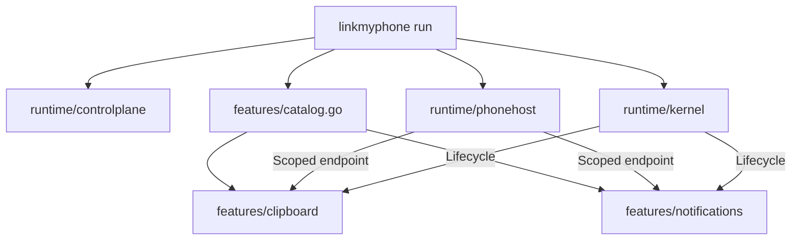

# Architecture overview

[Documentation index](../README.md)

The Go runtime shares one Phone Link host between the Clipboard and Notifications modules. Other Phone Link capabilities are not implemented. Microsoft services handle sign-in, device trust, wake and relay traffic.

New installations enroll as Phone Link (PL) after one device-code sign-in. Existing CrossDevice (WEA) states support Clipboard only. See [current support](../../README.md#current-support) and [test results](../research/validation.md#unified-pl-enrollment-2026-10-05).

## Runtime at a glance

One shared Phone Link host serves a registry of in-process feature modules:

Clipboard owns `clipboard/`, its wire protocol and native clipboard providers. Notifications owns `notifications/`, APP notification traffic, D-Bus and optional reply windows. Both use the shared host rather than reading the raw relay stream.

See the [source map](../developer/source-map.md) for every tracked package and its entry points.

## Ownership boundaries

| Owner | Owns | Must not own |
| --- | --- | --- |
| `runtime/kernel` | Generic manifests, feature records, required dependency resolution, per-entry lifecycle serialization, instance epochs, and live capability publication or revocation. | Clipboard routes or native clipboard behavior. |
| `runtime/phonehost` | Microsoft and DCG state resume, trust refresh, linked-peer selection, wake, PLATFORM `/SessionValidation`, one raw relay receive loop, and feature endpoints. | Feature-specific protocol or native behavior. |
| `runtime/controlplane` | Version 1 JSON-over-Unix-socket requests, responses, limits, permissions, and handler switching. | Microsoft or Hub Relay protocol. |
| `cmd/linkmyphone/runtime_control.go` | The transaction that reconciles persistence with the live registry. | Feature-domain behavior. |
| `features/catalog.go` | Builtin composition: manifest, defaults, validator, and factory. | Feature implementation details. |
| A feature package | Protocol routing, native integration, worker goroutines, bounded queues, generation arbitration, and diagnostics. | Direct reads from `transport/relay.Client.Received()`, or imports of another feature package. |

`runtime/phonehost` opens the shared cloud session. It resumes persisted Microsoft and DCG state, refreshes trust, selects a linked peer, connects Hub Relay, sends wake when needed, and completes PLATFORM `/SessionValidation`. The default selection requires exactly one Android peer. An explicit target can select another linked peer, without establishing compatibility with it.

`Router.Run` is the sole consumer of the relay client's raw `Received()` channel. The host continues draining that stream when no feature is enabled, so an empty registry cannot block relay acknowledgements or completions. `Router` matches each received message into feature-scoped bounded queues and clones payload bytes before fan-out. Each endpoint can send through the host transport while its subscription is live. A full queue revokes only that endpoint, closes its receive channel, and removes its send capability. A feature therefore cannot consume another feature's messages or take down the shared host through a slow receiver.

The [module contract](modules.md) describes lifecycle and extension rules. The [control-plane contract](control-plane.md) describes live reconciliation and the Unix socket.

## Startup and rollback

`linkmyphone run` opens the feature store, reserves the control socket, and installs a temporary handler that returns `runtime is starting; retry the feature command`. This reservation happens before Phone Link bootstrap, so a CLI command cannot mistake a booting runtime for an offline runtime and write the store directly.

The control socket replies to CLI requests during both startup and live operation:

| Phase | Owner and action |
| --- | --- |
| Reserve | `run` owns the socket before host bootstrap. Feature requests receive the starting error. |
| Bootstrap | Open `runtime/phonehost.Session`, load records through the controller, resolve catalog definitions, validate configurations, build modules, and register them. |
| Start | Start enabled entries only after required dependencies are ready. |
| Serve | Switch the same socket to the live controller and send systemd readiness when applicable. Each CLI request receives its own response. |

An enabled record with no catalog implementation prevents startup. A disabled record with no implementation remains readable and removable. A module start failure leaves the entry failed and prevents it from publishing live capabilities. If a later startup step fails, deferred cleanup stops every instance already started and closes the phone host. Registry rollback also stops an instance returned by a stale or failed start, with a ten-second rollback bound.

## Live operation and shutdown

The controller serializes requests with one mutex and gives each mutation a fifteen-second context. It reconciles runtime state and persistence in this order:

| Operation | Runtime transition | Persistence and rollback |
| --- | --- | --- |
| Create | Validate and build the module, register it, and start it when enabled. | Write the record after setup. A persistence failure deletes the runtime entry. |
| Update | Compute the desired record, stop a running instance, apply validated configuration, and start it again when enabled. | Write the new record after the runtime transition. A failure restores the previous record and running state where possible. |
| Enable or disable | Use update semantics. | Enabling an unavailable implementation is rejected. |
| Delete | Stop and remove the runtime entry first. | Delete the record. A persistence failure restores the registry entry and enabled instance where possible. |
| List or get | Read live kernel snapshots. | Return persisted records alongside snapshots. A snapshot includes state, enabled flag, configuration, version, epoch, and the last error when present. |

When a generation ends, operation contexts are cancelled before the socket handler changes. Handler replacement waits for in-flight calls, then `StopAll` stops entries in reverse actual start order and revokes capabilities. A failed session is closed before module teardown to interrupt blocked network I/O; normal shutdown can send advisory FEATURE_OFF first. The supervisor closes the session before opening a replacement. Final shutdown sets `runtime is stopping` and removes the control socket. Module stop is idempotent.

The phone host supervisor closes a failed generation, refreshes authentication and trust, wakes the same selected peer when needed, validates the new PLATFORM session, and recreates enabled modules. The control socket stays reserved and rejects mutations during the handoff. See [session resilience](session-resilience.md) for recovery ownership and [validation](../research/validation.md#session-resilience-2026-10-03) for the remaining live checks.

## Data and trust boundaries

Feature desired state defaults to `~/.config/linkmyphone/features.json`. The feature store uses schema version 1, rejects unknown top-level fields and malformed records, writes through a `0600` temporary file, syncs it, and atomically renames it into place. Before each save, the containing directory is created or restricted to mode `0700`, including an existing directory. Custom stores need a dedicated parent directory. This file contains desired state and feature configuration, not Microsoft identity state.

The Microsoft and DCG bootstrap state is separate, normally `~/.config/linkmyphone/state.json`, and contains refresh credentials and private key material. Keep it private. The phone host uses Microsoft cloud services for authentication and relay operation.

Feature permission declarations are metadata in runtime API 1.0. They do not sandbox a builtin or grant access. The runtime is an in-process builtin system: a builtin can reach any process and package APIs available to the executable. Out-of-process loading and sandbox enforcement require a separately versioned bridge and policy layer; neither exists in runtime API 1.0.

The built-in clipboard module is version `0.2.0` and supports plain text, HTML and images. Rich native providers use MIME polling, format-aware echo hashes and typed snapshots. Incoming image normalization preserves dimensions; only outbound preparation applies the PNG transfer limit. See [clipboard behavior](../user-guide/clipboard.md) for formats and budgets, and [validation](../research/validation.md#clipboard-validation-2026-10-03) for live reports and automated test results.
