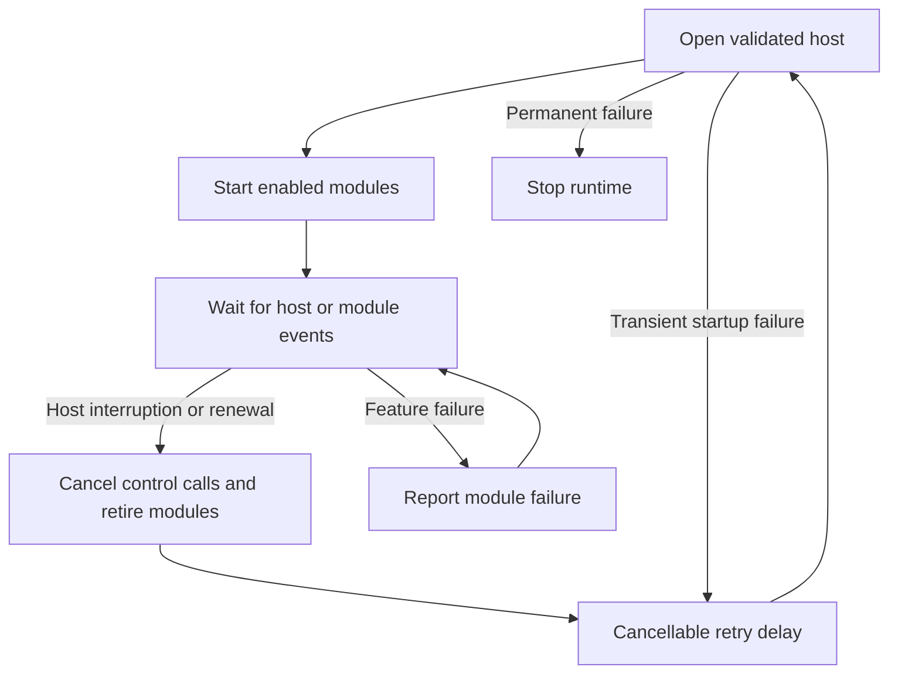

# Session resilience

[Architecture](overview.md) · [Operating behavior and live checks](../operations/session-recovery.md) · [Validation](../research/validation.md#session-resilience-2026-10-03)

The host supervisor owns recovery. Feature modules continue to own their domain protocol and local resources; a module cannot reconnect the shared relay itself.

## Ownership

| Owner | Contract |
| --- | --- |
| [phonehost/resilience.go](../../runtime/phonehost/resilience.go) | Retry classification, capped exponential backoff with equal jitter, Retry-After, startup deadline, peer pinning, token-renewal deadline and wall-clock health checks. |
| [phonehost/session.go](../../runtime/phonehost/session.go) | One authentication/trust/relay/wake/SessionValidation generation, router ownership and recoverable host-error reporting. |
| [runtime_run.go](../../cmd/linkmyphone/runtime_run.go) | Feature-generation construction and teardown; one stable control socket for managed run. Reload desired records on each generation. |
| [switch_handler.go](../../runtime/controlplane/switch_handler.go) and [runtime_control.go](../../cmd/linkmyphone/runtime_control.go) | Cancel old mutation contexts, wait for old handlers before swapping, reject cancelled controllers, and keep CRUD out of retired generations. |
| [bootstrap/resume.go](../../bootstrap/resume.go) | Checkpoint a rotated MSA refresh credential before DCG calls; save the new general token after same-identity SignIn. |
| [signalr/client.go](../../transport/signalr/client.go) | Bounded handshake, MessagePack Hub ping, server-silence deadline, typed HTTP status and Retry-After. |
| [wsclient/client.go](../../transport/wsclient/client.go) | Cancellation closes blocked handshake I/O; writes have deadlines; Close interrupts I/O without waiting for the writer lock. |
| [relay/client.go](../../transport/relay/client.go) | Retain peer disconnect counts so a fast reconnect still invalidates the platform generation. |

The callback to Supervise must finish its module teardown before returning a recoverable host error. A module/configuration/control-plane failure does not become an unlimited restart loop. Ordinary module runtime failures remain isolated by the kernel. Shutdown cancels the attempt or retry wait and stops the current generation.

Recovery creates a fresh relay/router/registry rather than changing the transport underneath active feature requests. Old CONTENT requests, snapshots and correlation IDs stay in their original generation. A replacement validates SessionValidation before creating features and starts from the latest successfully committed desired state.

Backoff grows across rapid failures and resets after a generation remains active for at least 30 seconds. Equal jitter waits between half and all of the current base delay. Retry-After is a lower bound. A relay 401 gets one refresh/reopen retry; persistent rejection and permanent OAuth/DCG failures stop. Invalid state or persistence failure never causes reenrollment.

Renewal uses the earlier of Microsoft expires_in and the DCG general token's absolute expiry. The margin is capped at one fifth of the lifetime; missing Microsoft expires_in uses a conservative 30-minute fallback, still bounded by DCG expiry. The five-second monitor compares wall time so suspend does not hide expiry behind a paused monotonic clock. A gap over 20 seconds also rebuilds the session. This is a Linux recovery heuristic, not a source-confirmed replacement for an OS resume-event API.

## Supplied-source observations

Reviewed the owner's ltw-baseline-20260929-203827(1).zip and phonelink-winrev(1).zip. Android observations use the Microsoft-Active JADX tree. Decompiled source files remain external research inputs and are not added to this repository.

| Supplied file | Observed behavior | Linux decision |
| --- | --- | --- |
| Windows YourPhone.YPP.SignalR.Transport.Connection/SignalRConnectionFactory.cs | Configures server timeout, keepalive, token provider and automatic reconnect. | Add deadlines and Hub pings around the existing MessagePack transport. |
| Windows YourPhone.YPP.SignalR/HubReconnectionRetryPolicy.cs | Uses configured retry intervals, stops when exhausted and treats 429 specially. | Use continuous capped backoff for a long-running daemon, plus Retry-After. These are Linux policy choices, not copied Windows values. |
| Windows YourPhone.YPP.SignalR/SignalRResiliencyPolicyFactory.cs | Excludes cancellation and account-token-provider errors from ordinary connection retry; first 401 forces a general-token refresh. | Classify permanent/cancelled failures separately and refresh credentials before retrying relay 401. |
| Windows YourPhone.YPP.Auth.ServicesClient/ScopedServicesAccessTokenProvider.cs | Requests general-scope service tokens through the auth manager. | Resume the existing identity and reconnect with a fresh general token. |
| Android signalr/transport/connection/SignalRConnectionV2.java | Tracks active open attempts, runs network/open/reconnect strategies, handles connection loss and bounds OnConnected waiting. | Retire an entire generation before replacement, with cancellable startup and finite per-attempt deadlines. |
| Android signalr/transport/connection/SignalRConfiguration.java | Separates network, initial-open and reconnect retry strategies. | Keep retry ownership in the host, independent of DCG fragment retry. |
| Android signalr/SignalRAccessTokenProvider.java | Retrieves general-scope tokens using an explicit retrieval policy. | Keep account/DCG authentication separate from application fragment delivery. |

The implementation is independent Go code using existing repository wire contracts. It recreates feature modules during renewal; it does not claim seamless in-place token rotation, Windows-identical retry timing, WAM parity, key rotation, or offline message replay.

## Regression evidence

| Behavior exercised | Tests |
| --- | --- |
| Backoff/cap/reset, startup deadline, cancellation, pinned target after teardown, transient versus permanent failure, relay 401 and throttling | [resilience_test.go](../../runtime/phonehost/resilience_test.go) |
| Earlier token expiry, capped renewal margin, peer loss, suspend/wall gap | [resilience_test.go](../../runtime/phonehost/resilience_test.go) |
| Credential checkpoint survives DCG outage and is consumed by retry; persistence failure stops further calls; old refresh credential retained when omitted; wrong identity rejected | [resume_persistence_test.go](../../bootstrap/resume_persistence_test.go) |
| Actual loopback WebSocket handshake cancellation/deadline, Hub ping wire shape, silent server timeout and Retry-After | [signalr/client_test.go](../../transport/signalr/client_test.go) |
| Blocked writer interrupted by Close | [shutdown_test.go](../../transport/wsclient/shutdown_test.go) |
| Fast phone disconnect/reconnect retains invalidation | [relay/client_test.go](../../transport/relay/client_test.go) |
| Old control handler drains, cancelled controller cannot commit desired state, and replacement reloads committed enable/config settings | [switch_handler_test.go](../../runtime/controlplane/switch_handler_test.go), [runtime_resilience_test.go](../../cmd/linkmyphone/runtime_resilience_test.go) |

Tests inject faults and clocks or use local HTTP/WebSocket servers. They establish local behavior, not Microsoft-service compatibility. See the dated [validation record](../research/validation.md#session-resilience-2026-10-03) for commands, environment limits and remaining live work.
