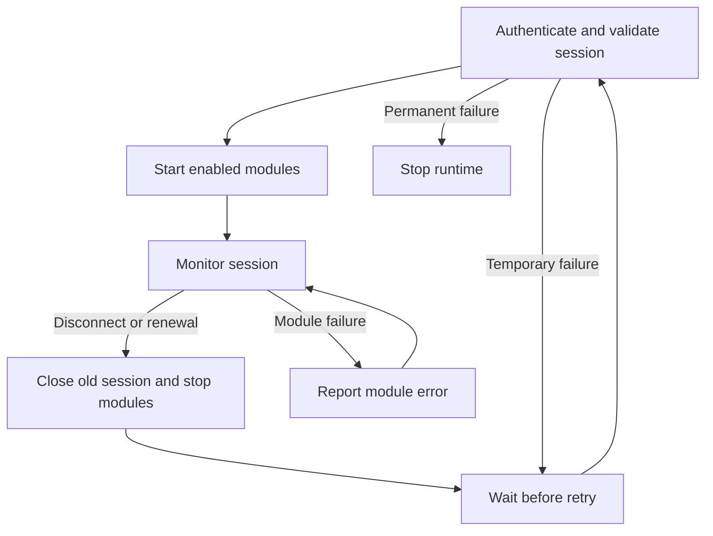

# Session resilience

[Architecture](overview.md) · [Session recovery guide](../operations/session-recovery.md) · [Test results](../research/validation.md#session-resilience-2026-10-03)

`phonehost.Supervise` opens and replaces cloud sessions. Each session has its own relay, router, feature registry and module instances. Feature modules use the host's endpoints and leave reconnection to the host.

## Session lifecycle

The callback passed to `Supervise` owns module startup and shutdown. It must finish teardown before returning a recoverable host error. The supervisor waits for that return before opening another session.

For `run`, teardown cancels the old controller's context and waits for active control calls to finish. It then closes the failed host and stops its modules. The control socket stays open, with a temporary handler that asks callers to retry. Once the replacement host passes SessionValidation, the runtime loads the saved feature records and installs a new controller.

Old requests, snapshots and correlation IDs stay with the old session. New modules start from the saved enabled flags and configuration. Registry epochs can restart at zero or one because each replacement has a new registry.

Feature configuration, control-server and teardown errors stop the runtime. A module's own runtime error is reported through the kernel while the shared host keeps running. Shutdown cancels the current attempt or retry wait, then stops the modules.

## Code map

| File | Responsibility |
| --- | --- |
| [phonehost/resilience.go](../../runtime/phonehost/resilience.go) | Retry policy, startup deadline, target pinning, token renewal and health monitor. |
| [phonehost/session.go](../../runtime/phonehost/session.go) | Open one authenticated session through trust, relay, wake and SessionValidation; report host failures. |
| [runtime_run.go](../../cmd/linkmyphone/runtime_run.go) | Start and stop module generations; reload feature records; keep the control socket. |
| [switch_handler.go](../../runtime/controlplane/switch_handler.go), [runtime_control.go](../../cmd/linkmyphone/runtime_control.go) | Drain old control calls and reject mutations after their controller is cancelled. |
| [bootstrap/resume.go](../../bootstrap/resume.go) | Save a rotated Microsoft refresh token before calling DCG; save the new general token after sign-in. |
| [signalr/client.go](../../transport/signalr/client.go) | Handshake timeout, Hub pings, read deadline and HTTP errors. |
| [wsclient/client.go](../../transport/wsclient/client.go) | Cancel blocked handshake I/O, bound writes and close a socket with a blocked writer. |
| [relay/client.go](../../transport/relay/client.go) | Count peer disconnects, including a disconnect/reconnect between monitor ticks. |

## Retry policy

The base delay starts at one second and doubles to a one-minute cap. Each retry waits between half and all of the base delay. After a session has run for at least 30 seconds, the next failure starts again at the minimum. Retry-After sets a minimum wait and can exceed the cap.

Temporary network errors, timeouts and retryable HTTP failures reopen the session. Invalid local state, failed credential writes, identity mismatches and permanent OAuth/DCG errors stop it. A relay 401 gets one refresh-and-reopen attempt; a repeated 401 stops it. Recovery reuses the enrolled identity and keys.

The first successful session pins the phone's DCG ID. Subsequent discovery must return that phone.

## Token renewal and health checks

Renewal uses the earlier of Microsoft `expires_in` and the DCG general token's absolute expiry. The default margin is two minutes, limited to one fifth of the remaining lifetime. If Microsoft omits `expires_in`, the calculation uses 30 minutes and still respects the DCG expiry.

A refreshed Microsoft credential is saved before any DCG call. If DCG sign-in fails, the next attempt can use the rotated credential. A successful sign-in must return the existing device identity before its general token is saved.

The health monitor runs every five seconds. It checks the renewal deadline, the selected phone's connection state and its disconnect count. It also compares wall-clock readings: a gap over 20 seconds reopens the session after suspend or a clock jump.

## Source notes

The source review used `ltw-baseline-20260929-203827.zip` and `phonelink-winrev.zip`. Android paths are relative to `jadx/Microsoft-Active/sources/com/microsoft/mmx/agents/ypp/`; Windows paths are relative to the decompiled root. The decompiled files are kept outside this repository.

| Source file | Behavior used in the design |
| --- | --- |
| Windows `YourPhone.YPP/YourPhone.YPP.SignalR.Transport.Connection/SignalRConnectionFactory.cs` | Sets server timeout, keepalive, token provider and automatic reconnect. |
| Windows `YourPhone.YPP/YourPhone.YPP.SignalR/HubReconnectionRetryPolicy.cs` | Uses configured retry intervals, stops when they run out and handles HTTP 429 specially. |
| Windows `YourPhone.YPP/YourPhone.YPP.SignalR/SignalRResiliencyPolicyFactory.cs` | Excludes cancellation and account-token errors from connection retry; refreshes the general token after the first 401. |
| Windows `YourPhone.YPP.Auth/YourPhone.YPP.Auth.ServicesClient/ScopedServicesAccessTokenProvider.cs` | Requests general-scope service tokens through the auth manager. |
| Android `signalr/transport/connection/SignalRConnectionV2.java` | Tracks open attempts, runs network/open/reconnect strategies and bounds the OnConnected wait. |
| Android `signalr/transport/connection/SignalRConfiguration.java` | Defines network, initial-open and reconnect retry strategies. |
| Android `signalr/SignalRAccessTokenProvider.java` | Retrieves general-scope tokens with a token-retrieval policy. |

The Linux daemon retries temporary failures until shutdown or a permanent error. Its delay values are defined in `phonehost`, independently of the Windows retry configuration. Renewal opens a fresh session and restarts modules. The supervisor keeps enrolled keys and discards interrupted requests; key rotation and offline replay are outside its scope. Account authentication follows the [Linux device-code flow](../protocol/authentication.md).

## Tests

| Test file | Cases |
| --- | --- |
| [resilience_test.go](../../runtime/phonehost/resilience_test.go) | Backoff, jitter, startup timeout, cancellation, target pinning, teardown order, fatal errors, 401, Retry-After, renewal timing, suspend and peer loss. |
| [resume_persistence_test.go](../../bootstrap/resume_persistence_test.go) | Rotated credential saved before DCG; retry uses it; failed writes stop cloud calls; omitted refresh token keeps the old one; identity mismatch rejected. |
| [signalr/client_test.go](../../transport/signalr/client_test.go) | Handshake cancellation and timeout, Hub Ping framing, silent-server timeout and Retry-After. |
| [shutdown_test.go](../../transport/wsclient/shutdown_test.go) | Close interrupts a blocked writer. |
| [relay/client_test.go](../../transport/relay/client_test.go) | A fast peer reconnect keeps its disconnect count. |
| [switch_handler_test.go](../../runtime/controlplane/switch_handler_test.go), [runtime_resilience_test.go](../../cmd/linkmyphone/runtime_resilience_test.go) | Handler handoff, cancelled mutations, saved feature state and live enable after replacement. |

See [validation](../research/validation.md#session-resilience-2026-10-03) for the full-suite and device test results.
