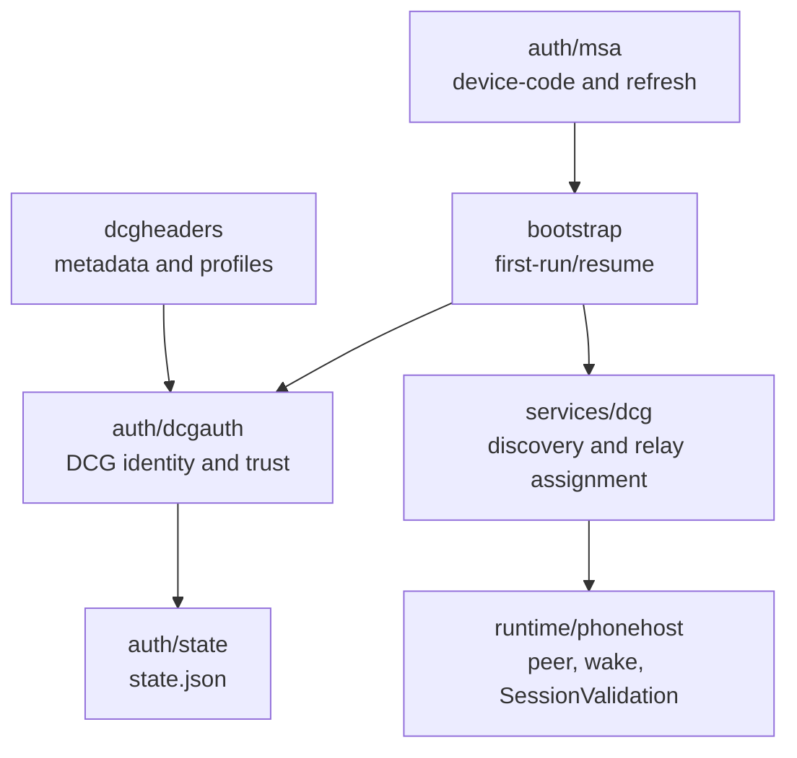
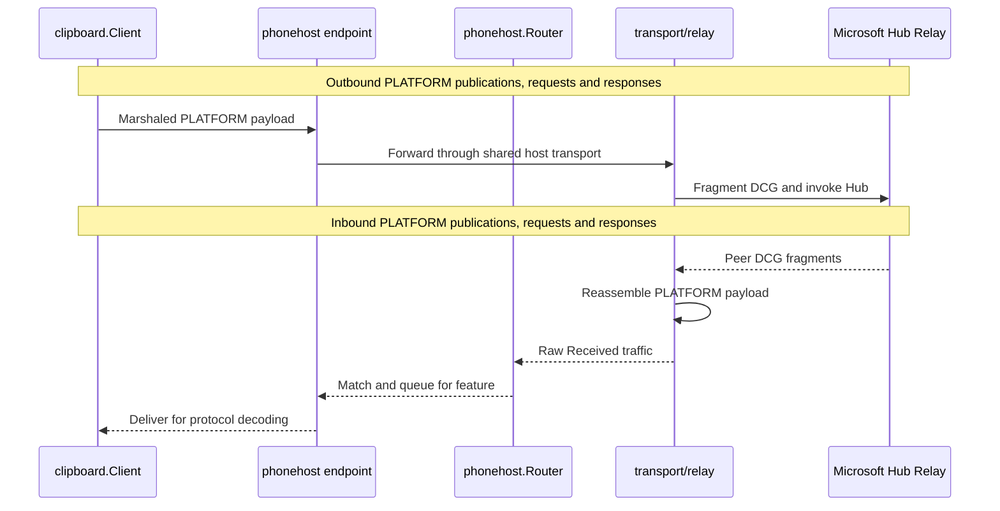

# Source map

[Documentation index](../README.md)

Start here when you know the behavior but not the package. The repository is organized by ownership. Begin at `cmd/linkmyphone/main.go` for command dispatch, then follow the contract owner in the index below. The [architecture overview](../architecture/overview.md) shows runtime flow, and the [module architecture](../architecture/modules.md) describes builtin lifecycle ownership.

## Find a path by behavior

| Behavior to change | First path | Contract |
| --- | --- | --- |
| CLI dispatch, feature CRUD, runtime startup, or service commands | [`cmd/linkmyphone`](../../cmd/linkmyphone) | [Control-plane contract](../architecture/control-plane.md) |
| Builtin registration or defaults | [`features/catalog.go`](../../features/catalog.go) | [Module architecture](../architecture/modules.md) |
| Generic lifecycle, dependencies, epochs, capabilities, or desired state | [`runtime/kernel`](../../runtime/kernel) | [Module architecture](../architecture/modules.md) |
| Session recovery and token-renewal policy | [resilience.go](../../runtime/phonehost/resilience.go) | [Session resilience](../architecture/session-resilience.md) |
| Shared cloud session, peer selection, wake, SessionValidation, or feature subscriptions | [`runtime/phonehost`](../../runtime/phonehost) | [Architecture overview](../architecture/overview.md) |
| Local JSON-over-Unix-socket protocol | [`runtime/controlplane`](../../runtime/controlplane) | [Control-plane contract](../architecture/control-plane.md) |
| Clipboard behavior or Linux desktop integration | [`clipboard`](../../clipboard) and [`features/clipboard`](../../features/clipboard) | [Clipboard behavior](../user-guide/clipboard.md) |
| Wire encoding or transport | [`protocol`](../../protocol) and [`transport`](../../transport) | [Transport and framing](../protocol/transport.md) |
| Identity, trust, persisted credentials, or cloud bootstrap | [`auth`](../../auth) and [`bootstrap`](../../bootstrap) | [Authentication and bootstrap](../protocol/authentication.md) |

## Commands and composition

| Path | Role and entry points |
| --- | --- |
| [`cmd/linkmyphone`](../../cmd/linkmyphone) | User-facing command dispatch and orchestration. `main.go` selects probes, `feature`, `run`, `service`, and `clipboard-sync`, and also hosts the hidden native watch helper. `runtime_run.go` opens the host and managed registry. `runtime_control.go` applies live CRUD transactions and rollback. `feature.go` implements offline or socket-routed feature commands. `service.go` installs and manages the systemd user unit. `session_probe.go`, `peer_probe.go`, and `main.go` contain opt-in Microsoft probes. |
| [`features/catalog.go`](../../features/catalog.go) | Builtin composition. It returns each manifest, default configuration, validator, and module factory. `Find` resolves IDs compiled into the executable. |
| [`features`](../../features) | Feature packages. The only current package is [`features/clipboard`](../../features/clipboard), which owns clipboard business behavior. |
| [`contracts/manifests`](../../contracts/manifests) | Versioned JSON Schema for feature manifests. It is a contract artifact, not a loader or runtime sandbox. |

## Authentication, trust, and bootstrap

| Path | Role and entry points |
| --- | --- |
| [`auth/msa`](../../auth/msa) | Microsoft identity-platform device-code configuration, device-code login, polling, and token refresh. |
| [`auth/dcgauth`](../../auth/dcgauth) | DCG production client, identity and certificate primitives, enrollment, device metadata, trust identity, and trust relationships. |
| [`auth/state`](../../auth/state) | Persistent bootstrap state load and save. The state includes refresh credentials and private key material and is separate from feature desired state. |
| [`auth/bootstrap`](../../auth/bootstrap) | Bridges an acquired Microsoft access token into DCG identity creation and validates the returned `general` token against the new identity. |
| [`bootstrap`](../../bootstrap) | End-to-end first-run and resume orchestration. `first_run.go`, `resume.go`, `enroll.go`, `trust.go`, `peer.go`, `wake.go`, and `cloud.go` connect authentication, enrollment, peer trust, wake, and SignalR. `session.go` validates PLATFORM capabilities, `context.go` performs the diagnostic clipboard publication exchange, and `state.go` assembles persisted enrollment state. |
| [`dcgheaders`](../../dcgheaders) | CrossDevice client metadata, compatibility profile, and DCG header construction. |
| [`services/dcg`](../../services/dcg) | HTTP client and service models for DCG device discovery and assigned relay information. |

Authentication ownership is **Microsoft token → bootstrap → DCG identity, trust, state, and relay discovery**. This is a package map, not an execution-order diagram.

<details>
<summary>Authentication package chart</summary>



</details>

## Clipboard and protocol layers

| Path | Role and entry points |
| --- | --- |
| [`clipboard`](../../clipboard) | Domain clipboard client and native Linux integration. `client.go` owns request dispatch, correlation snapshots, generation ordering, publication, phone CONTENT pulls, and feature-state requests. `content.go` validates typed content, preserves received dimensions and prepares outbound PNG. `native_content.go` discovers and transfers MIME selections; `html_offer.py` offers HTML plus plain text. `native.go` detects and invokes Wayland or X11 utilities without a shell. `native_watch.go` frames `wl-paste --watch` events and implements the hidden helper. |
| [`protocol/clipboard`](../../protocol/clipboard) | Clipboard request, response, item, PubSub, and Device Resource Manager codecs. |
| [`protocol/platform`](../../protocol/platform) | PLATFORM message headers, routes, and binary message framing. |
| [`protocol/msaep`](../../protocol/msaep) | MSAEP envelope and message-tag encoding used by cloud PubSub. |
| [`protocol/dcg`](../../protocol/dcg) | DCG fragment encoding, reassembly, acknowledgements, message type values, and packet constants. |
| [`protocol/sessionvalidation`](../../protocol/sessionvalidation) | PLATFORM `/SessionValidation` request and response codec. |
| [`protocol/signalr`](../../protocol/signalr) | MessagePack Hub Protocol values, invocation and completion messages, trace context, record framing, and decode logic. |

| Direction | Clipboard behavior |
| --- | --- |
| Linux to phone | Observe typed local content, prepare outbound PNG within 1 MiB when applicable, publish tag 9 through `PubSubPayload.Data`, then answer the phone's matching CONTENT request with the snapshot. |
| Phone to Linux | Decode tag 9 from `PubSubPayload.Additional`, pull CONTENT through the endpoint, then normalize supported IMAGE bytes to PNG without resizing, then apply typed text/HTML/image content to the native clipboard. |

All raw incoming relay traffic passes through the shared router before a matcher-scoped feature endpoint. The endpoint is the clipboard client's transport; only the router consumes raw `Received()` traffic.

<details>
<summary>Linux publication layers in plain text</summary>

```text
local clipboard
  -> clipboard.Client
  -> protocol/clipboard
  -> protocol/msaep tag 9
  -> protocol/platform /Context/Publish
  -> phonehost matcher-scoped endpoint
  -> transport/relay (fragments via protocol/dcg)
  -> transport/signalr and transport/wsclient
  -> Microsoft Hub Relay
```

</details>

<details>
<summary>Shared outbound and inbound transport sequence</summary>



</details>

`clipboard.Client` invokes the protocol codecs to marshal or parse PLATFORM payloads. `transport/relay` owns DCG fragmentation and reassembly, while the phone host owns routing. Native writes belong only to the phone-to-Linux CONTENT path, not to the local publication path.

## Runtime and ownership

| Path | Role and entry points |
| --- | --- |
| [`runtime/kernel`](../../runtime/kernel) | Generic feature registry. `manifest.go` parses strict manifests; `store.go` persists desired-state records; `registry.go` owns lifecycle, dependency ordering, epochs, rollback, failures, and `StopAll`; `capability.go` owns live capability publication and revocation; `reporter.go` defines structured diagnostics. |
| [`runtime/phonehost`](../../runtime/phonehost) | Shared Phone Link session. `session.go` resumes state, refreshes trust, selects a peer, connects Hub Relay, wakes the peer, validates PLATFORM, and starts routing. `router.go` is the sole raw relay receiver and creates matcher-scoped bounded endpoints. |
| [`runtime/controlplane`](../../runtime/controlplane) | Version 1 JSON-over-Unix-socket protocol. `protocol.go` defines requests, responses, operations, and store-scoped socket paths. `server.go` enforces limits and permissions. `client.go` performs timed calls. `switch_handler.go` changes startup, live, and stopping handlers without replacing the socket. |
| [`runtime/systemdnotify`](../../runtime/systemdnotify) | Optional systemd readiness and stopping notifications used by the managed runtime. |
| [`packaging/systemd`](../../packaging/systemd) | Embedded user service unit and its `systemd --user` packaging data. The unit runs `linkmyphone run` after `graphical-session.target` with bounded failure restart and `KillMode=mixed`. |

The phone host owns exactly one raw `transport/relay` receive loop. A feature receives an endpoint from `Session.Subscribe`; it never reads the raw relay channel. Endpoint queues are bounded, payload bytes are cloned for fan-out, and overflow revokes only the affected subscriber.

## Transport layers

| Path | Role and entry points |
| --- | --- |
| [`transport/wsclient`](../../transport/wsclient) | Minimal WebSocket client used by SignalR transport. |
| [`transport/signalr`](../../transport/signalr) | SignalR WebSocket connection, handshake, receive loop, Hub invocation, completions, and trace metadata. |
| [`transport/relay`](../../transport/relay) | DCG Hub Relay client. It fragments outbound payloads, waits for Hub completions and DCG acknowledgements, reassembles inbound fragments, and exposes the raw receive stream consumed only by `runtime/phonehost.Router`. |

## Tests by package

Tests sit beside the implementation. The most useful invariant owners are:

- [`runtime/kernel/*_test.go`](../../runtime/kernel) for manifests, persistence, dependencies, epochs, capability revocation, stale completion, and teardown;
- [`runtime/phonehost/*_test.go`](../../runtime/phonehost) for routing, bounded endpoint overflow, cancellation, and session registration;
- [`runtime/controlplane/controlplane_test.go`](../../runtime/controlplane/controlplane_test.go) for socket security, wire versioning, startup and shutdown switching, path hashing, handler isolation, and client behavior;
- [`features/*_test.go`](../../features) and [`features/clipboard/*_test.go`](../../features/clipboard) for catalog, config, matcher, module stop, worker, and native observation contracts;
- [`cmd/linkmyphone/*_test.go`](../../cmd/linkmyphone) for CLI CRUD and runtime orchestration;
- [`clipboard/*_test.go`](../../clipboard) for native backend, watch framing, protocol client, generation ordering, echo suppression, and correlation snapshots;
- [`protocol/**/*_test.go`](../../protocol) for wire codecs and framing;
- [`transport/**/*_test.go`](../../transport) for WebSocket, SignalR, and relay behavior;
- [`auth/**/*_test.go`](../../auth), [`bootstrap/**/*_test.go`](../../bootstrap), [`dcgheaders/**/*_test.go`](../../dcgheaders), and [`services/dcg/**/*_test.go`](../../services/dcg) for local authentication, state, headers, trust, bootstrap, and service contracts.

The full command list and deterministic versus opt-in live scenarios are in [testing](testing.md).
