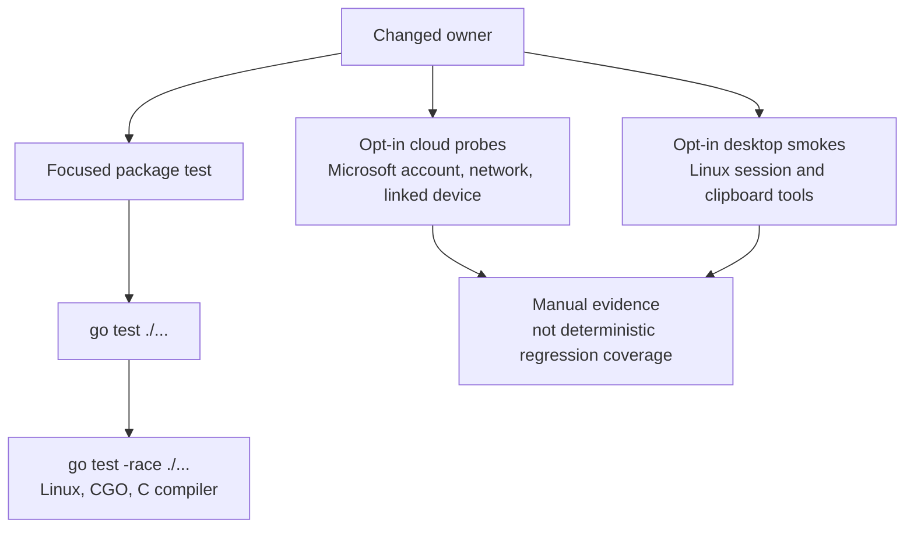

# Testing

[Documentation index](../README.md)

Use the smallest test command that owns the behavior, then run the full Linux suite before submitting. Tests are Go package tests. The deterministic suite uses fakes, temporary stores, protocol fixtures, and injected transports. It does not require Microsoft authentication or a desktop clipboard session.

## Supported commands

Run on Linux from the repository root with Go 1.23 or newer. The full suite exercises Unix sockets and file permissions. The race detector also needs a CGO-enabled toolchain and a C compiler.

```bash
go test ./...
go test -race ./...
```

Choose the lane that matches the evidence you need:

| Lane | Prerequisites | Proves |
| --- | --- | --- |
| Package and full suite | Linux, Go 1.23+ | Deterministic behavior using isolated fakes and fixtures. |
| Race detector | Linux, CGO, C compiler | Data races exercised by the suite. |
| Cloud probe | Microsoft account, network, linked device | A finite exchange with live services, not regression coverage. |
| Desktop smoke | Linux graphical session, clipboard tools | Visible clipboard behavior in that session. |

<details>
<summary>Test lane chart</summary>



</details>

### Package commands

The same package commands are useful while changing one owner:

```bash
go test ./runtime/kernel
go test ./runtime/phonehost
go test ./runtime/controlplane
go test ./features/...
go test ./clipboard ./protocol/... ./transport/...
go test ./cmd/phonelink-linux
```

Use a package's existing test names for a focused run, for example:

```bash
go test ./runtime/kernel -run 'TestRegistry|TestFeatureStore'
go test ./runtime/phonehost -run 'TestRouter|TestSession'
go test ./runtime/controlplane -run 'TestServer|TestListen|TestCall|TestSocket'
go test ./cmd/phonelink-linux -run 'TestFeatureCommand'
go test ./features/clipboard -run 'TestConfig|TestManifest|TestInstanceStop'
```

The CI workflow at [`.github/workflows/ci.yml`](../../.github/workflows/ci.yml) is configured with `workflow_dispatch`, uses the Go version declared by `go.mod`, and runs `go test ./...`. It is currently manual-only. The historical README attributed that setting to an exhausted Actions-minute quota; the repository does not establish the current quota. Format changed Go files with `gofmt`. No separate linter, release command, or coverage threshold is configured here.

## Invariant map

Run the test package that owns the invariant after changing its implementation. The full suite remains the final local check.

| Consumer-visible invariant | Tests and owner |
| --- | --- |
| Unknown manifest fields, trailing JSON, unsafe schema paths, duplicates, invalid IDs, incompatible API versions, and incomplete metadata are rejected | `runtime/kernel/manifest_test.go`, `runtime/kernel/manifest.go` |
| Feature records survive reopen, duplicate IDs fail, configs are JSON objects, saves are atomic and private | `runtime/kernel/store_test.go`, `runtime/kernel/store.go` |
| Required providers start before dependents; missing providers block; compatible versions are required; provider teardown is protected | `runtime/kernel/registry_test.go`, `runtime/kernel/registry.go` |
| An old instance cannot mutate a replacement epoch; dependency failure degrades active dependents; a stale start is rolled back and its capabilities never become live | `runtime/kernel/registry_test.go` |
| Stop removes capabilities and remains safe to repeat; stopped update preserves the stopped lifecycle fact | `runtime/kernel/registry_test.go`, `features/clipboard/module_test.go` |
| The raw relay stream has one receiver; matching messages fan out with copied payloads; a slow bounded endpoint is revoked without harming another endpoint | `runtime/phonehost/router_test.go`, `runtime/phonehost/session_test.go` |
| Endpoint close revokes sending and closes receiving; router cancellation and no-subscriber draining work | `runtime/phonehost/router_test.go` |
| Control requests use version 1, unknown fields fail, socket paths are store-scoped and short, permissions are `0700` for the directory and `0600` for the socket, and stale sockets are replaced safely | `runtime/controlplane/controlplane_test.go` |
| Startup and shutdown handler transitions are visible without replacing the socket; handler panic is isolated; active handlers drain on close | `runtime/controlplane/controlplane_test.go`, `cmd/phonelink-linux/runtime_run.go` |
| Connected CLI mutations do not fall back to offline persistence when the runtime rejects them; stale records can be disabled and deleted | `cmd/phonelink-linux/feature_test.go` |
| Offline feature create, update, toggle, delete, manifest lookup, and default configuration follow the catalog contract | `cmd/phonelink-linux/feature_test.go`, `features/catalog_test.go` |
| Clipboard config rejects unknown and out-of-range values and the manifest exposes all three text capabilities | `features/clipboard/config_test.go` |
| Clipboard stop does not spend the full request timeout on advisory `FEATURE_OFF` and is idempotent after cancellation | `features/clipboard/module_test.go` |
| Clipboard protocol codecs, platform routes, MSAEP envelopes, DCG fragments, SignalR framing, and relay transport preserve their wire contracts | `protocol/**`, `transport/**`, `clipboard/*_test.go` |
| Native clipboard commands avoid a shell, detect supported Wayland or X11 utilities, normalize empty Wayland selection, and frame watch-helper events | `clipboard/native_test.go`, `clipboard/native_watch_test.go` |
| Clipboard generation ordering, correlation snapshots, stale publication rejection, echo suppression, and request handling remain deterministic | `clipboard/client_test.go`, `clipboard/generation_test.go`, `clipboard/generation_order_test.go`, `clipboard/retired_snapshot_test.go` |
| Wayland event coalescing, nil-selection debounce, polling fallback, and shutdown ownership remain bounded | `features/clipboard/sync_test.go`, `features/clipboard/matcher_test.go`, `clipboard/native_watch_test.go` |
| Auth state persistence, identity primitives, device-code handling, trust, and bootstrap stage transitions preserve their local contracts | `auth/**/*_test.go`, `bootstrap/**/*_test.go` |
| Header profiles and DCG service request behavior remain source-compatible | `dcgheaders/**/*_test.go`, `services/dcg/**/*_test.go` |
| systemd readiness notification reports the runtime state without changing module ownership | `runtime/systemdnotify/*_test.go` |

Tests are not substitutes for the ownership rules. When changing a queue, endpoint, or worker, add or update a test that observes the feature or shared host behavior, not just an internal field or a mock call count.

## Microsoft cloud probes

These commands are opt-in production scenarios. They require a Microsoft account, linked devices, network access, and a safe local state path. Do not run them in automated tests or with credentials in command arguments. They may create or update `~/.config/phonelink-linux/state.json`, which contains refresh credentials and private key material.

```bash
go run ./cmd/phonelink-linux bootstrap-probe
go run ./cmd/phonelink-linux peer-probe
go run ./cmd/phonelink-linux session-probe
go run ./cmd/phonelink-linux session-probe --context-probe
```

The first probe performs device-code login, DCG identity enrollment, trust refresh, and SignalR connection. Later probes reuse persisted identity state. `peer-probe` selects or wakes a linked Android peer. `session-probe` validates PLATFORM `/SessionValidation`; `--context-probe` observes the tag-9 clipboard publication path without returning clipboard content unless an explicit probe text is supplied. These probes exercise Microsoft cloud behavior and should be treated as manual evidence, not deterministic regression tests.

The runtime path uses the same cloud stages:

```bash
go run ./cmd/phonelink-linux feature create --enabled phonelink.clipboard
go run ./cmd/phonelink-linux run
```

With a running `run` process, feature CRUD uses the hashed Unix socket and reports live state and epochs. Long-running reconnect, peer wake after later disconnects, and token refresh during a long session remain open limitations even where dated production validation succeeded for startup and live CRUD. See the [validation research](../research/validation.md) for historical reports and their environment.

## Desktop and systemd smokes

These scenarios need a Linux desktop session and native clipboard utilities. They are not part of `go test`:

```bash
go run ./cmd/phonelink-linux clipboard-sync
go run ./cmd/phonelink-linux clipboard-sync --poll-interval 250ms
go run ./cmd/phonelink-linux service install
go run ./cmd/phonelink-linux service status
go run ./cmd/phonelink-linux service logs --follow
go run ./cmd/phonelink-linux service restart
go run ./cmd/phonelink-linux service uninstall
```

Wayland uses `wl-paste --watch` when available and debounces transient `CLIPBOARD_STATE=nil` ownership gaps. X11 and watch failure use bounded polling. A desktop smoke should observe local copy, phone-to-Linux write, reflected-echo suppression, genuine clear, and clean Ctrl+C or service stop. Keep clipboard text non-sensitive. `service install` changes the user executable and systemd unit, so use a disposable user environment when testing installation behavior.

The archived project findings include dated Wayland, S23, and systemd validation reports, plus race-test repetitions. Those reports are evidence of the environments described at the time, not a promise that an untested machine or a current Microsoft service will behave the same way.
