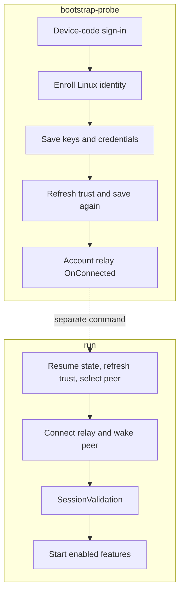

# First run and enrollment

[Documentation index](../README.md)

LinkMyPhone aims to bring the Phone Link experience to Linux. This guide exercises its first implemented feature: clipboard synchronization, using the shared account, enrollment, and phone-session setup.

Use this guide to create the Linux identity, select the linked phone, and start clipboard sync. The phone and Windows PC must already be linked in Microsoft Link to Windows / Phone Link under the Microsoft account you will use. The Linux host also needs a working network connection and, for clipboard sync, a graphical clipboard provider.

LinkMyPhone does not discover or pair a new phone. It enrolls a Linux DCG identity, asks Microsoft for devices already linked to the account, and selects one of those peers.

| Command | Where it stops |
| --- | --- |
| `bootstrap-probe` | Sign in, enroll, save keys, refresh and save trust, then await account relay `OnConnected`. |
| `run` | Resume the saved profile, select and wake a peer, validate its session, and start enabled features. |

<details>
<summary>Enrollment and runtime stage chart</summary>



</details>

## 1. Create the persistent identity

Run the probe from the repository, or replace it with the installed binary:

```bash
linkmyphone bootstrap-probe
```

On a new state path, the command prints a Microsoft device-code verification URL and a one-time code. Open the URL in a browser, sign in with the account that owns the existing Link to Windows relationship, and wait for the command to continue. It then:

1. enrolls the Linux DCG device;
2. saves the new identity and refresh credentials;
3. retrieves linked-device metadata and builds trust relationships;
4. obtains an assigned SignalR shard and waits for the account-level Hub Relay connection.

The command does not print secrets. It writes state before later cloud stages, so resume a failure after enrollment instead of deleting files or creating another identity.

This ordering describes the CLI probe. The library first-run path saves after trust is established, so callers using the library should keep its staged-persistence behavior rather than assuming the CLI order.

The default state path is `~/.config/linkmyphone/state.json`. Use another path when you intentionally maintain a separate account or test state:

```bash
linkmyphone bootstrap-probe --state "$HOME/.config/linkmyphone-test/state.json"
```

The other bootstrap flags are documented in the [CLI reference](../reference/cli.md). They change compatibility metadata sent to Microsoft's service. Keep their defaults unless a deployment-specific requirement gives you a reason to change them.

### Separate Phone Link enrollment

The default `crossdevice` profile preserves the existing WEA/clipboard identity. Full notification push uses a genuine `phonelink` (PL) enrollment, not a changed request body on an unrelated WEA identity:

```bash
linkmyphone bootstrap-probe --profile phonelink \
  --state "$HOME/.config/linkmyphone-notifications/state.json"
```

Use a **new state path**. The CLI refuses to change the profile of an existing enrollment and requires an explicit state path for a new PL enrollment. The chosen profile is saved with its identity and determines the Microsoft OAuth client ID, DCG app ID and enrollment client type on every resume. Old state without `clientProfile` remains CrossDevice. Keep any working clipboard service and state separate during a notification trial; a new enrollment changes the account's device/trust list.


## 2. Resume an existing enrollment

Run `bootstrap-probe` again, or start `run`, `peer-probe`, or `session-probe` with the same state path. An existing state file is loaded and the program refreshes the Microsoft token, signs the existing DCG identity in, refreshes linked-device trust, and reconnects SignalR. Normal resume calls DCG `SignIn`; it does not create a second identity.

A missing state file is an enrollment problem, not a clipboard problem. Run `bootstrap-probe` first. A malformed or unsupported state file is refused so that the program does not silently create a different identity.

## 3. Select the linked phone

If exactly one linked Android device is returned, the default target is that device. With no `--target`, startup fails when there are no linked Android devices or when more than one linked Android device is returned.

Select a target by its DCG ID, exact name, exact model name, or an unambiguous case-insensitive partial match:

```bash
linkmyphone run --target "My phone"
```

The selector applies only to devices returned by Microsoft's `DeviceInfoList`; it cannot pair a new device. An ambiguous selector is rejected instead of choosing arbitrarily. The host checks Hub Relay presence and sends a signed wake request when the target is not already present, then performs PLATFORM `/SessionValidation` before starting feature modules.

An explicit selector can match any linked peer returned by the service, including a non-Android device. That is selection behavior, not a compatibility guarantee. The recorded clipboard checks used an S23; other peer types are unvalidated.

## 4. Create and run clipboard sync

The modular runtime reads desired feature records from `features.json`. Create the built-in clipboard feature and request that it start:

```bash
linkmyphone feature create --enabled linkmyphone.clipboard
linkmyphone run
```

The option appears before the positional feature ID because the CLI uses Go's standard flag parser. `feature create` defaults to disabled when `--enabled` is omitted. `run` starts every enabled, available feature in the registry and keeps one shared Phone Link host session open.

If the record already exists, inspect it with `feature get linkmyphone.clipboard` and enable it with `feature enable linkmyphone.clipboard` instead of creating it again.

Check desired and live state from another terminal while the runtime is ready:

```bash
linkmyphone feature list
linkmyphone feature get linkmyphone.clipboard
```

The first host startup can take time while authentication, trust refresh, peer wake, SignalR, and SessionValidation complete. If you run a feature command while the runtime is still starting, it returns `runtime is starting; retry the feature command`. Retry it after the runtime announces readiness. See [clipboard behavior](../user-guide/clipboard.md) for backend selection and first-publication semantics.

## 5. Check both clipboard directions

1. Keep `run` open until the host and clipboard module report readiness.
2. Copy fresh, non-sensitive text on Linux and paste it into a text field on the phone.
3. Copy different harmless text on the phone and paste it into a Linux text editor.
4. Check the runtime's direction and byte-count events. The logs intentionally omit the copied text.
5. Press Ctrl+C and confirm that the module stops cleanly.

Also copy a formatted HTML fragment and an image in each direction. Use an HTML-capable paste target for formatting and the same image file when comparing Linux with Windows. Check dimensions and successful paste; rich content support is documented in the [clipboard guide](../user-guide/clipboard.md).

The clipboard value present before startup is not sent by default. Test with a new copy after readiness, and avoid passwords or private text while synchronization is enabled. The [clipboard guide](../user-guide/clipboard.md) explains initial publication, clear events, conflicts, and reflected updates.

<details>
<summary>Optional probes and implementation references</summary>

These are diagnostic commands, not a second pairing flow:

```bash
linkmyphone peer-probe
linkmyphone session-probe
```

`peer-probe` resumes state, refreshes trust, selects or wakes the target, and stops after the target is present on Hub Relay. `session-probe` continues through PLATFORM `/SessionValidation`; `--context-probe` additionally sends the source-confirmed clipboard publication shape. By default that context probe declines a CONTENT request rather than sending clipboard text. Supplying `--context-text` opts into an explicit text response.

Implementation references: [`cmd/linkmyphone/main.go`](../../cmd/linkmyphone/main.go) contains the probe stages and flags; [`bootstrap/first_run.go`](../../bootstrap/first_run.go) defines the enrollment pipeline; [`bootstrap/first_run_test.go`](../../bootstrap/first_run_test.go) exercises its staged persistence behavior; resume uses [`bootstrap/resume.go`](../../bootstrap/resume.go).

</details>

## What remains open

An internet connection is required for Microsoft sign-in, device trust, relay and wake. `run` reconnects after network loss or suspend and restarts enabled modules. See [session recovery](../operations/session-recovery.md) for what to expect during an interruption, and [test results](../research/validation.md) for the tested devices and remaining checks.
