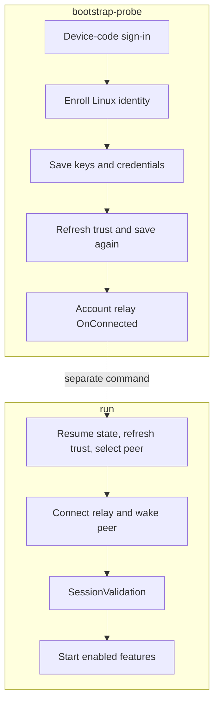

# First run and enrollment

[Documentation index](../README.md)

LinkMyPhone uses one Phone Link (`phonelink` / PL) enrollment and one Microsoft device-code sign-in for clipboard and notifications on a fresh install. The phone must already be linked in Link to Windows under that account. Clipboard sync needs a graphical clipboard provider; notifications need Android notification access and a desktop notification service.

LinkMyPhone does not discover or pair a new phone. It enrolls a Linux DCG identity, asks Microsoft for devices already linked to the account, and selects one of those peers.

| Command | Where it stops |
| --- | --- |
| `bootstrap-probe` | Sign in, enroll, save keys, refresh and save trust, then await account relay `OnConnected`. |
| `run` | Resume the saved profile, select and wake a peer, validate its session, and start enabled features. |

<details>
<summary>Enrollment and runtime stage chart</summary>



</details>

## 1. Create the persistent identity

Run the probe from the repository, or replace it with the installed binary:

```bash
linkmyphone bootstrap-probe
```

On a new state path, the command prints a Microsoft device-code verification URL and a one-time code. Open the URL in a browser, sign in with the account that owns the existing Link to Windows relationship, and wait for the command to continue. The new enrollment uses PL, so clipboard and notifications can share the saved identity. It then:

1. enrolls the Linux DCG device;
2. saves the new identity and refresh credentials;
3. retrieves linked-device metadata and builds trust relationships;
4. obtains an assigned SignalR shard and waits for the account-level Hub Relay connection.

The command does not print secrets. It writes state before later cloud stages, so resume a failure after enrollment instead of deleting files or creating another identity.

This ordering describes the CLI probe. The library first-run path saves after trust is established, so callers using the library should keep its staged-persistence behavior rather than assuming the CLI order.

The default state path is `~/.config/linkmyphone/state.json`. Use another path when you intentionally maintain a separate account or test state:

```bash
linkmyphone bootstrap-probe --state "$HOME/.config/linkmyphone-test/state.json"
```

The other bootstrap flags are documented in the [CLI reference](../reference/cli.md). They change compatibility metadata sent to Microsoft's service. Keep their defaults unless a deployment-specific requirement gives you a reason to change them.

### Existing CrossDevice and trial Phone Link enrollments

Old `state.json` files without `clientProfile` and explicitly enrolled `crossdevice` (WEA) states remain WEA. Resume never changes their identity or keys. They still support clipboard, but cannot receive full notification push. **Do not edit `clientProfile` or overwrite a WEA state with PL keys.**

If a PL trial state already exists, reuse its `--state` path for `bootstrap-probe` and `run` and enable **both** feature records in the same feature store. No second Microsoft sign-in or device enrollment is needed. Keep the old WEA state as a backup until clipboard and notifications on PL work for your phone; stop the old clipboard service before starting the combined runtime so two processes do not race to synchronize the clipboard. The feature store is independent of authentication: use `feature create`/`feature enable` against the store selected by `run --features-state`.

If you have only a WEA enrollment, leave it intact. Full notifications require a *new* PL enrollment on another `--state` path (and one new device-code sign-in for that upgrade); one PL enrollment then serves both features on subsequent runs. New installations use PL without an extra sign-in. This is not an in-place upgrade of WEA trust or OAuth credentials.

Grant Link to Windows notification access on the phone and run a desktop notification service on Linux. If either is missing, or the phone connection fails, Notifications will not report Ready. New phone items update the matching desktop notification; phone removals close it. Items that were already on the phone stay quiet when the app starts unless you change `show_existing`.

Set `remote_actions=true` if you want desktop dismissal, app buttons and confirmed replies to affect the phone. With it off, notifications are receive-only. Timeout and programmatic closes do not dismiss phone notifications. Reply needs Python GI/GTK4 and sends text only after you confirm it. A successful phone response means Android accepted the request; it does not prove a message reached its recipient. See [notification settings](../reference/configuration.md#notification-configuration) and [privacy](../operations/privacy-and-state.md#notifications).

The owner signed in once on S23 and ran both modules together. Clipboard text moved in both directions; phone-to-Linux HTML and image copies also appeared in the runtime log. Phone notifications arrived on the desktop, and Like, reply and dismiss worked in the owner's Messenger test. The journal matched each desktop action with Android's response and the later notification removal. [Test results](../research/validation.md#notification-desktop-actions-on-unified-enrollment-2026-10-05) also list what has not been checked: permission revocation, forced network loss, long-running recovery and other phones.


## 2. Resume an existing enrollment

Run `bootstrap-probe` again, or start `run`, `peer-probe`, or `session-probe` with the same state path. An existing state file is loaded and the program refreshes the Microsoft token, signs the existing DCG identity in, refreshes linked-device trust, and reconnects SignalR. Normal resume calls DCG `SignIn`; it does not create a second identity.

A missing state file is an enrollment problem, not a clipboard problem. Run `bootstrap-probe` first. A malformed or unsupported state file is refused so that the program does not silently create a different identity.

## 3. Select the linked phone

If exactly one linked Android device is returned, the default target is that device. With no `--target`, startup fails when there are no linked Android devices or when more than one linked Android device is returned.

Select a target by its DCG ID, exact name, exact model name, or an unambiguous case-insensitive partial match:

```bash
linkmyphone run --target "My phone"
```

The selector applies only to devices returned by Microsoft's `DeviceInfoList`; it cannot pair a new device. An ambiguous selector is rejected instead of choosing arbitrarily. The host checks Hub Relay presence and sends a signed wake request when the target is not already present, then performs PLATFORM `/SessionValidation` before starting feature modules.

An explicit selector can match any linked peer returned by the service, including a non-Android device. That is selection behavior, not a compatibility guarantee. The recorded clipboard checks used an S23; other peer types are unvalidated.

## 4. Enable clipboard and notifications in one runtime

Create both built-in feature records in the **same** feature store, then run once with the **same** PL state:

```bash
linkmyphone feature create --enabled linkmyphone.clipboard
linkmyphone feature create --enabled --config '{"remote_actions":false}' linkmyphone.notifications
linkmyphone run
```

The option appears before the positional feature ID because the CLI uses Go's standard flag parser. `feature create` defaults to disabled when `--enabled` is omitted. `run` starts both modules on one shared Phone Link host session. If a record already exists, inspect it with `feature get ID` and enable it with `feature enable ID` instead of creating it again. For an existing PL state at another path, pass its path to `run --state PATH`; pass the same `--state FEATURE_PATH` to both feature commands and `--features-state FEATURE_PATH` to `run`.

Check desired and live state from another terminal while the runtime is ready:

```bash
linkmyphone feature list
linkmyphone feature get linkmyphone.clipboard
```

The first host startup can take time while authentication, trust refresh, peer wake, SignalR, and SessionValidation complete. If you run a feature command while the runtime is still starting, it returns `runtime is starting; retry the feature command`. Retry it after the runtime announces readiness. See [clipboard behavior](../user-guide/clipboard.md) for backend selection and first-publication semantics.

## 5. Check both clipboard directions

1. Keep `run` open until the host and clipboard module report readiness.
2. Copy fresh, non-sensitive text on Linux and paste it into a text field on the phone.
3. Copy different harmless text on the phone and paste it into a Linux text editor.
4. Check the runtime's direction and byte-count events. The logs intentionally omit the copied text.
5. Press Ctrl+C and confirm that the module stops cleanly.

Also copy a formatted HTML fragment and an image in each direction. Use an HTML-capable paste target for formatting and the same image file when comparing Linux with Windows. Check dimensions and successful paste; rich content support is documented in the [clipboard guide](../user-guide/clipboard.md).

The clipboard value present before startup is not sent by default. Test with a new copy after readiness, and avoid passwords or private text while synchronization is enabled. The [clipboard guide](../user-guide/clipboard.md) explains initial publication, clear events, conflicts, and reflected updates.

<details>
<summary>Optional probes and implementation references</summary>

These are diagnostic commands, not a second pairing flow:

```bash
linkmyphone peer-probe
linkmyphone session-probe
```

`peer-probe` resumes state, refreshes trust, selects or wakes the target, and stops after the target is present on Hub Relay. `session-probe` continues through PLATFORM `/SessionValidation`; `--context-probe` additionally sends the source-confirmed clipboard publication shape. By default that context probe declines a CONTENT request rather than sending clipboard text. Supplying `--context-text` opts into an explicit text response.

Implementation references: [`cmd/linkmyphone/main.go`](../../cmd/linkmyphone/main.go) contains the probe stages and flags; [`bootstrap/first_run.go`](../../bootstrap/first_run.go) defines the enrollment pipeline; [`bootstrap/first_run_test.go`](../../bootstrap/first_run_test.go) exercises its staged persistence behavior; resume uses [`bootstrap/resume.go`](../../bootstrap/resume.go).

</details>

## What remains open

An internet connection is required for Microsoft sign-in, device trust, relay and wake. `run` reconnects after network loss or suspend and restarts enabled modules. See [session recovery](../operations/session-recovery.md) for what to expect during an interruption, and [test results](../research/validation.md) for the tested devices and remaining checks.
