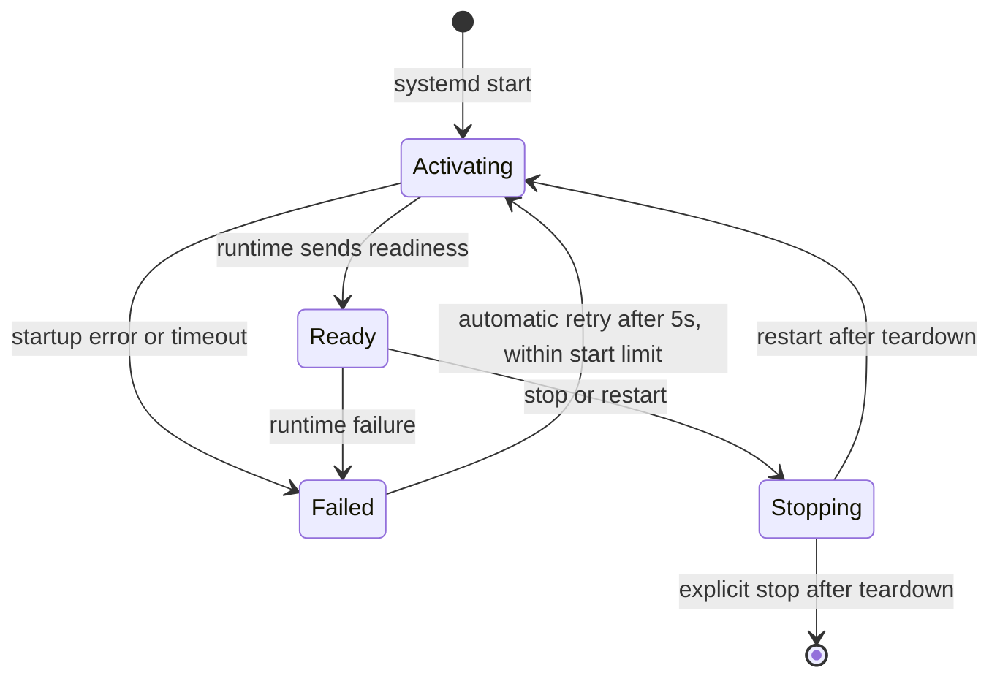

# systemd user service

[Documentation index](../README.md)

The optional systemd integration runs the same modular `run` command as an interactive session. It is a per-user service tied to the graphical login, not a machine-wide daemon.

## Migrate the old service

LinkMyPhone does not migrate or remove a Phone Link Linux installation automatically. The old and new service names are distinct; installing the new unit does not stop the old daemon.

1. Before deleting anything, inspect `systemctl --user cat phonelink-linux.service` and privately save any drop-ins, explicit authentication/feature paths, and phone target that you need to carry forward. If the old unit is installed, stop and disable it:

   ```bash
   systemctl --user disable --now phonelink-linux.service
   systemctl --user is-active phonelink-linux.service
   ```

   The second command should report `inactive` (with a non-zero exit status). If stopping fails or the process remains active, resolve that before proceeding. Also stop foreground old runtimes and probes, and remove any other autostart entry for the old binary.
2. [Migrate state and feature IDs](../reference/configuration.md#migrate-from-phone-link-linux) while all writers are stopped. Preserve secret permissions and the existing device identity; there is no automatic conversion. Custom paths and `$XDG_CONFIG_HOME` must be handled explicitly.
3. If the old installed executable is available, use it to remove its unit and binary:

   ```bash
   "$HOME/.local/bin/phonelink-linux" service uninstall
   ```

   Otherwise, after confirming the old daemon is stopped and disabled, manually remove the old user unit from `${XDG_CONFIG_HOME:-$HOME/.config}/systemd/user/phonelink-linux.service` and the old binary from `~/.local/bin/phonelink-linux`, then run `systemctl --user daemon-reload`. Review and remove the old `phonelink-linux.service.d/` drop-ins after saving any required settings. Remove other old binary copies or script references yourself. Do not delete the migrated authentication or feature files.
4. Build `linkmyphone` and install it with `./linkmyphone service install --enable=false --start=false`. Recreate any needed overrides under `linkmyphone.service`, updating `ExecStart` to `%h/.local/bin/linkmyphone run` and explicitly selecting the migrated custom paths and target where needed. Old unit drop-ins are not inherited.
5. Inspect `systemctl --user cat linkmyphone.service`, then reload, enable, and start using the commands below. Confirm that only the new service runs and that it uses the intended identity and feature store.

For an installation without systemd, perform the same stopped-runtime state migration, replace the binary on your `PATH`, and update every script or autostart command before restarting.


## Install and start

Build the executable and run the installer from the same executable you want systemd to use:

```bash
go build -o linkmyphone ./cmd/linkmyphone
./linkmyphone service install
```

The installer:

- copies the current executable atomically to `~/.local/bin/linkmyphone`;
- writes the unit to `$XDG_CONFIG_HOME/systemd/user/linkmyphone.service`, or `~/.config/systemd/user/linkmyphone.service`;
- imports the supported graphical-session environment;
- reloads the systemd user manager;
- when starting, clears previous failed/start-limit state;
- enables the unit and restarts it onto the newly copied executable by default.

Use flags before any positional arguments:

```bash
./linkmyphone service install --start=false
./linkmyphone service install --enable=false
```

`--start=false` installs and reloads without starting. `--enable=false` installs without enabling automatic graphical-session startup. The false flags skip actions. They do not disable an already enabled unit or stop a process that is already running.

The installed unit executes `%h/.local/bin/linkmyphone run`, so authentication and feature paths come from the service user's environment and defaults.

Stop an interactive `linkmyphone run` before starting the service. Both modes own the same per-feature-store control socket; running both would contend for the runtime rather than create independent state.

## Manage the service

```bash
~/.local/bin/linkmyphone service status
~/.local/bin/linkmyphone service start
~/.local/bin/linkmyphone service restart
~/.local/bin/linkmyphone service stop
~/.local/bin/linkmyphone service enable
~/.local/bin/linkmyphone service disable
```

`start` and `restart` import the current graphical-session environment, clear failed/start-limit state, and then invoke `systemctl --user`. `service install` imports the environment before daemon reload as well.

To refresh environment values after a desktop session change:

```bash
~/.local/bin/linkmyphone service import-environment
~/.local/bin/linkmyphone service restart
```

The imported variables are `WAYLAND_DISPLAY`, `DISPLAY`, `XAUTHORITY`, `XDG_SESSION_TYPE`, `XDG_CURRENT_DESKTOP`, `XDG_SESSION_DESKTOP`, `XDG_CONFIG_HOME`, `XDG_STATE_HOME`, and `XDG_DATA_HOME`. `XDG_RUNTIME_DIR` is not imported; it belongs to the systemd user manager and login session.

The unit is `Type=notify`. The runtime sends readiness only after the control socket, Phone Link host, desired feature loading, and live feature controller are ready. `systemctl start` therefore waits through host authentication, trust refresh, peer presence, SessionValidation, and module startup. While the unit is still activating, feature commands return `runtime is starting; retry the feature command`.

| Transition | Behavior |
| --- | --- |
| Start | Stay `activating` until the runtime sends readiness. |
| Failure | Retry after 5 seconds, subject to the five-starts-per-60-seconds limit. |
| Restart | Stop modules and watchers, then activate again. |
| Explicit stop | Stop modules and watchers without an automatic restart. |

<details>
<summary>Readiness and restart state chart</summary>



</details>

The packaged unit has these lifecycle settings:

```ini
Type=notify
Restart=on-failure
RestartSec=5s
StartLimitIntervalSec=60
StartLimitBurst=5
TimeoutStartSec=90s
TimeoutStopSec=20s
KillMode=mixed
UMask=0077
```

It is enabled under and joined to `graphical-session.target`. The main process receives the normal stop signal first; the runtime shuts down modules and the clipboard watcher, while systemd can terminate remaining cgroup processes if shutdown exceeds the timeout.

## Use a custom profile or phone target

Service helpers do not remember options from a previous foreground `run`. The packaged `ExecStart` uses defaults. If you need a different account state, feature store, or phone selector, configure a systemd drop-in instead of editing the installed unit.

First prepare the enrollment and enabled feature record at the chosen paths, following [first-run setup](../getting-started/first-run.md) and [configuration](../reference/configuration.md). Then install without starting or enabling the default command:

```bash
./linkmyphone service install --enable=false --start=false
systemctl --user edit linkmyphone.service
```

For example, enter this drop-in for a test profile and a specific linked phone:

```ini
[Service]
ExecStart=
ExecStart=%h/.local/bin/linkmyphone run --state %h/.config/linkmyphone-test/state.json --features-state %h/.config/linkmyphone-test/features.json --target "My phone"
```

`%h` is systemd's home-directory specifier. The unit does not invoke a shell. Use paths that contain the intended enrollment and feature records; changing `ExecStart` does not create them.

Stop any foreground runtime using that store, then reload and start:

```bash
systemctl --user daemon-reload
~/.local/bin/linkmyphone service enable
~/.local/bin/linkmyphone service restart
```

Reinstallation replaces the packaged unit and executable but does not remove your drop-ins. Inspect the effective command with `systemctl --user cat linkmyphone.service` when diagnosing a path or target mismatch.

## Logs and start-limit recovery

Service output goes to the user journal:

```bash
~/.local/bin/linkmyphone service logs
~/.local/bin/linkmyphone service logs --follow
~/.local/bin/linkmyphone service logs --lines 250
journalctl --user -u linkmyphone.service --no-pager
```

`service install`, `service start`, and `service restart` call `systemctl --user reset-failed` before launching. If you use `systemctl` directly after repeated failures, clear the rate limit first:

```bash
systemctl --user reset-failed linkmyphone.service
~/.local/bin/linkmyphone service import-environment
~/.local/bin/linkmyphone service start
```

Common startup causes are a missing enrollment file, no linked target, an unavailable clipboard provider, missing graphical-session variables, or a feature configuration that fails validation. Read the first failure stage in the journal before changing state. See [troubleshooting](troubleshooting.md).

## Uninstall and persistence

```bash
~/.local/bin/linkmyphone service uninstall
```

Uninstall stops and disables the unit, removes the user unit and installed binary, reloads the user manager, and clears failed state. To remove the unit while keeping the installed executable:

```bash
~/.local/bin/linkmyphone service uninstall --keep-binary
```

Uninstall does not remove `state.json`, `features.json`, or other authentication and desired-state files. Remove those separately only when you intentionally want to discard the local identity and feature configuration. See [privacy and state](privacy-and-state.md).

Custom systemd drop-ins are also retained. Review any `linkmyphone.service.d/` directory under your user unit configuration before reinstalling; remove only overrides you intentionally want to discard.

## Validation record and open limits

The dated systemd install, readiness, empty-clipboard, restart, stop/start, logout/login, watcher, and live-control observations belong to the repository research record. Read [the validation history](../research/validation.md) for the environment, commands, and scope of those reports. They are historical evidence, not a claim that this documentation run repeated a live Microsoft or systemd test.

Long-running reconnect, wake, and token-refresh resilience remains open. A service restart policy handles process failure; it does not establish full Phone Link recovery behavior after every network, suspend, or credential interruption.

The unit source is [`packaging/systemd/linkmyphone.service`](../../packaging/systemd/linkmyphone.service); installer behavior is implemented in [`cmd/linkmyphone/service.go`](../../cmd/linkmyphone/service.go) and covered by [`cmd/linkmyphone/service_test.go`](../../cmd/linkmyphone/service_test.go).
