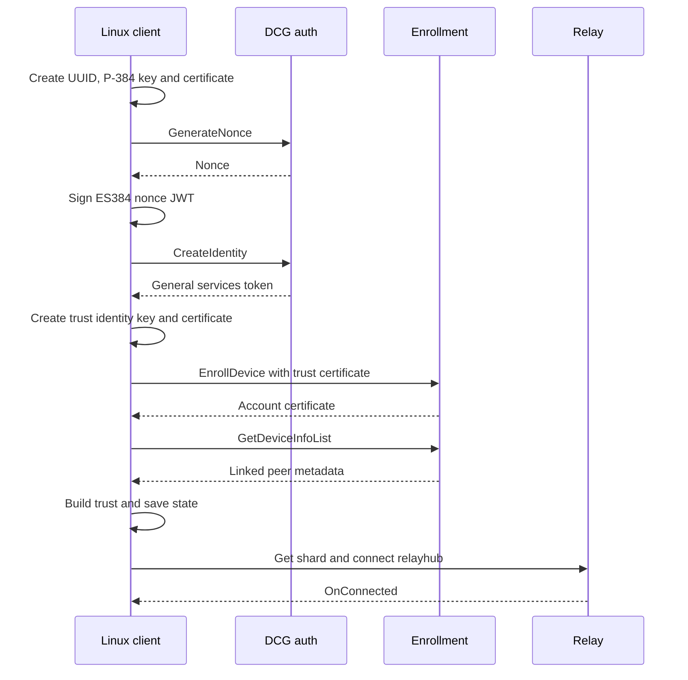

# Authentication, enrollment, and session reference

[Documentation index](../README.md)

Phone Link interoperability uses Microsoft cloud services. The Linux client keeps three related identities and two token systems separate because enrollment, trust, wake, and relay traffic use different credentials.

Related evidence: [research findings](../research/findings.md), [historical validation](../research/validation.md), and [development history](../research/history.md).

## Start here: first-run sequence

With an MSA access token, the library's `bootstrap.BootstrapFirstRun` follows these phases:

| Phase | Local and cloud work |
| --- | --- |
| Auth identity | Create the local UUID, P-384 key, and certificate before requesting a nonce. |
| DCG authentication | Request `GenerateNonce`, sign the nonce JWT locally, and call `CreateIdentity` for a services token. |
| Enrollment | Create the local `trust_<dcg-client-id>` key and certificate; `EnrollDevice` returns the account certificate. |
| Trust and persistence | Fetch `GetDeviceInfoList`, build trust relationships, and save local state. |
| Relay | Obtain the assigned shard, connect `relayhub/`, and await `OnConnected`. |

<details>
<summary>Local identity and cloud exchange sequence</summary>



</details>

The state write precedes relay connection. If the relay fails after persistence, the result can resume without creating a second DCG identity. The public `bootstrap-probe` CLI has a deliberate difference: it saves after enrollment, synchronizes trust, saves again, and only then connects the account relay. That preserves new keys when trust discovery fails. The two paths are implemented in [`bootstrap/first_run.go`](../../bootstrap/first_run.go#L47-L165), [`bootstrap/enroll.go`](../../bootstrap/enroll.go#L25-L70), and [`cmd/linkmyphone/main.go`](../../cmd/linkmyphone/main.go#L160-L264).

The production service base is `https://dcg.microsoft.com/`, with default Hub endpoint `relayhub/`. Compatibility metadata defaults to app version `1.26072.116.0`, ring `Public`, and advertised OS version `10.0.26100`. The OS value describes a Windows-compatible service profile, not the Linux host version. Defaults are in [`auth constants`](../../auth/dcgauth/constants.go#L5-L26) and [`phone-host defaults`](../../runtime/phonehost/session.go#L21-L24); the [CLI reference](../reference/cli.md) lists overrides.

## Contract at a glance

| Boundary | Implemented contract |
| --- | --- |
| Microsoft account | Windows CrossDevice uses WAM parameters; Linux uses the Microsoft identity-platform device authorization grant. |
| DCG identity | `GenerateNonce` plus a P-384 certificate JWT creates or signs in the local DCG identity. |
| Trust identity | A second certificate named `trust_<local-dcg-client-id>` signs peer wake and is enrolled as `SelfSigned`. |
| Enrollment | `EnrollDevice` returns an account certificate; `GetDeviceInfoList` supplies linked peer trust. |
| Persistence | State stores the refresh token, both key pairs, service token, enrollment material, and trust relationships with mode `0700` for the directory and `0600` for the file. |
| Relay and wake | Assigned SignalR shards use the `general` DCG services token; wake uses a trust-identity `DCG-CryptoWakeJwt`. |
| Resume | Refresh the MSA token, obtain a fresh nonce, call `/Auth/SignIn`, and keep the same DCG client ID. |

Microsoft services provide account tokens, enrollment, device trust, relay and wake. The runtime refreshes credentials and reopens the session after an interruption. See [session recovery](../operations/session-recovery.md) for retry behavior.

## Identity and token roles

| Role | Created or acquired by | Used for | Persisted form |
| --- | --- | --- | --- |
| Microsoft account token | Microsoft identity-platform device-code flow on Linux, or WAM in the Windows implementation | DCG auth and device-management calls as an MSA bearer | Access token is transient; refresh token is in the state file |
| DCG auth identity | `GenerateNonce` followed by a P-384 certificate JWT and `CreateIdentity` | Signs in the local DCG device and receives a DCG services token | DCG device ID, PKCS#8 private key, and certificate |
| DCG services token | `CreateIdentity` or `SignIn`, normalized to scope `general` | SignalR relay and DCG service operations such as wake | Token metadata and expiry are in the state file |
| Trust identity | A second certificate created for `trust_<local-dcg-client-id>` | Signs peer wake and is registered with enrollment as `SelfSigned` | Trust client ID, PKCS#8 private key, and certificate |
| Account trust | Enrollment response account certificate | A2D trust relationship for the account certificate | Certificate and relationship metadata |
| Peer trust | Linked peer metadata from `GetDeviceInfoList` | AsyncD2D authentication of a linked device | Peer certificate and relationship metadata |

The auth identity and trust identity are different. `auth/dcgauth/identity.go` defines the former, `auth/dcgauth/trust_identity.go` defines the latter, and `bootstrap/wake.go` signs wake data with the trust identity. The state schema storing both key pairs is in [`auth/state/store.go`](../../auth/state/store.go#L20-L50).

## Microsoft account acquisition

The Windows CrossDevice path uses Web Account Manager (WAM), with provider `https://login.microsoft.com`, authority `consumers`, and public CrossDevice client ID `ca3b40e4-3001-4842-8f21-49c0045404f8`. WAM requests a service scope in this form:

```text
<scope>&api-version=2.0&clientid=<MSA app ID>
```

That suffix is a WAM request format, not a generic OAuth v2 scope. Constants and formatting are in [`auth/msa/config.go`](../../auth/msa/config.go#L5-L25) and [`auth/dcgauth/constants.go`](../../auth/dcgauth/constants.go#L21-L46). The source findings report WAM statuses such as `UserInteractionRequired` and `AccountSwitch`; the decompiled YPP layer did not show an interactive sign-in fallback.

Linux uses the Microsoft identity-platform device authorization grant with this migrated resource scope:

```text
https://dcg.microsoft.com/DCG.ReadWrite offline_access
```

`auth/msa` posts `client_id` and `scope` to `/consumers/oauth2/v2.0/devicecode`, polls `/token` with the device-code grant, handles `authorization_pending` and `slow_down`, and can refresh a saved refresh token. The implementation labels this an interoperability experiment, not a source-confirmed replacement for WAM. See [`auth/msa/devicecode.go`](../../auth/msa/devicecode.go#L21-L24) and [`auth/msa/devicecode_test.go`](../../auth/msa/devicecode_test.go#L13-L123).

The repository history records one production probe that received HTTP 200 from the device-code endpoint for the public client and migrated scope. That is historical validation, not a guarantee that the service or account is available now. Do not put access tokens, refresh tokens, device codes, or account payloads in issues or sample output.

### Compatibility constants

| Constant or format | Meaning |
| --- | --- |
| `service::msatoken.dcg.microsoft.com::MBI_SSL` | Legacy MSA portal resource scope retained as a compatibility constant |
| `https://dcg.microsoft.com/DCG.ReadWrite` | Migrated first-party DCG resource scope used by Linux device-code and resume paths |
| `general` | DCG services token scope returned after DCG identity creation or sign-in |
| `1.1.0` | Auth service API version |
| `1.5.0` | Device-management API version |
| `relayhub/` | Default SignalR hub path |

The values are declared in [`auth/dcgauth/constants.go`](../../auth/dcgauth/constants.go#L5-L40). A compatibility constant does not mean every authentication path uses it.

## DCG identity cryptography

`NewIdentity` generates a random UUID device ID, an ECDSA P-384 key, and a self-signed SHA-384 certificate. The subject common name is the device ID. The certificate is valid from 12 hours before the supplied time through 365 days after it and permits digital signatures.

The nonce JWT contains:

- `iss`, set to the DCG device ID;
- `nbf`, set to 12 hours before the signing time;
- `exp`, set to 12 hours after the signing time;
- `Nonce`, from `GenerateNonce`;
- `Certificate`, containing the base64 DER certificate.

The JWT header is `ES384` and `JWT`; its signature is the fixed-width 96-byte P-384 `r || s` form. These implementation contracts are in [`auth/dcgauth/identity.go`](../../auth/dcgauth/identity.go#L31-L150), with claim and signature checks in [`auth/dcgauth/identity_test.go`](../../auth/dcgauth/identity_test.go#L14-L75).

## Auth service routes and headers

All four auth routes use `api-version=1.1.0`:

| Method and route | Request body | Result |
| --- | --- | --- |
| `POST /Auth/GenerateNonce` | `{"deviceId":"..."}` | `nonce`, optional epoch timestamp |
| `POST /Auth/CreateIdentity` | `{"certificateJWT":"..."}` | DCG access token, device ID, expiry metadata |
| `POST /Auth/SignIn` | `{"certificateJWT":"..."}` | A new DCG access token for the existing identity |
| `POST /Auth/RotateKeys` | Modeled as a route constant; no public high-level method currently performs the operation | Key rotation endpoint compatibility |

The client sends JSON plus `Authorization: Bearer <MSA token>`, `UserIdentityType: MSA`, `UserIdentityToken: <MSA token>`, and `Authorization-Type: MSA`. Source-compatible client headers come from `dcgheaders.ClientInfo`. See [`auth/dcgauth/client.go`](../../auth/dcgauth/client.go#L108-L145) and [`auth/dcgauth/client.go`](../../auth/dcgauth/client.go#L206-L260). Wire tests cover route bodies, token conversion, and device-ID mismatch rejection in [`auth/dcgauth/client_test.go`](../../auth/dcgauth/client_test.go#L13-L132).

A successful identity token must contain an access token, device ID, and expiration epoch. The implementation stores it under `general`; a response whose device ID differs from the active identity is rejected. `CreateIdentity` does not persist the new private key itself. The caller persists it only after the service accepts the certificate JWT.

## Enrollment and linked-device discovery

The normal silent enrollment call is:

```text
POST /DeviceAuthProxy/EnrollDevice?api-version=1.5.0
Authorization: Bearer <MSA access token>
Authorization-Type: MSA
Dcg-Token: <DCG general token>
Content-Type: application/json
```

The JSON request has `certificates` and `metadata`. The normal request registers the trust certificate under `SelfSigned`. Windows-compatible metadata uses client type `WEA`, OS name `Windows`, `IsEnabled: true`, explicit client/display/OS versions, and `Unknown` manufacture/model fields. An optional `pop-device-key` query parameter is sent only when supplied; an empty value is omitted. The response must include `accountCert` and may include account info, linked devices, and a root certificate chain. See [`auth/dcgauth/enroll.go`](../../auth/dcgauth/enroll.go#L15-L167) and [`auth/dcgauth/enroll_test.go`](../../auth/dcgauth/enroll_test.go#L12-L96).

These metadata fields are compatibility metadata, not a claim that Linux is a Windows device. The implementation intentionally sends the source-compatible profile because it is the enrolled service contract used by this project.

Discovery uses:

```text
GET /DeviceAuthProxy/GetDeviceInfoList?api-version=1.5.0&top=20&filter=
Authorization: Bearer <MSA access token>
Authorization-Type: MSA
```

`DeviceInfoItem.ID` is the peer DCG client ID. Candidates are linked devices whose ID is not the local DCG ID. Trust storage maps a DCG ID to `trust_<dcg-client-id>`. For each linked peer, certificate selection prefers the first `PKI` certificate and falls back to the first `SelfSigned` certificate. Non-iOS async trust also requires bit `0x20` in JSON `yppCapabilities`; iOS is treated as supporting async trust unconditionally. See [`auth/dcgauth/devices.go`](../../auth/dcgauth/devices.go#L14-L124) and [`auth/dcgauth/devices_test.go`](../../auth/dcgauth/devices_test.go#L11-L67). The default selection requires exactly one Android peer. An explicit target can match another returned linked peer, without establishing compatibility with that peer.

The enrollment account certificate becomes an A2D relationship. Its certificate subject common name supplies the account DCG client ID. Linked peer certificates become AsyncD2D relationships. Both relationships map `dcg_prod_client_id` to the partner DCG ID. Certificate expiration is checked and capped at the default one-year lifetime. Relationship IDs, certificate preference, and trust types are in [`auth/dcgauth/trust.go`](../../auth/dcgauth/trust.go#L12-L148), with assertions in [`auth/dcgauth/trust_test.go`](../../auth/dcgauth/trust_test.go#L9-L73) and orchestration in [`bootstrap/trust.go`](../../bootstrap/trust.go#L1-L107).

Trust and feature permissions are separate. Device metadata capabilities describe advertised device or feature support; they do not sandbox or enforce authorization boundaries in the local process.

## Persistence and resume

The default auth state path is the platform user configuration directory followed by `linkmyphone/state.json`, normally `~/.config/linkmyphone/state.json`. The state directory is mode `0700`; the state file is mode `0600`.

The JSON snapshot contains:

- a stable logical-device ID;
- the MSA refresh token;
- the DCG and trust key pairs as PKCS#8 private keys plus DER certificates;
- the `general` services token and expiry metadata;
- the account certificate, account info, and root certificate chain;
- trust relationships.

Writes use a temporary file, `Sync`, rename, and a final mode check. `Save` also applies mode `0700` to the existing parent directory; it does not assume the parent was newly created. Schema and permission behavior are in [`auth/state/store.go`](../../auth/state/store.go#L18-L207); round-trip and mismatched-certificate tests are in [`auth/state/store_test.go`](../../auth/state/store_test.go#L12-L96).

On restart, the client refreshes the MSA access token with the saved refresh token, restores both key pairs, obtains a fresh nonce, and calls `/Auth/SignIn`. It does not call `/Auth/CreateIdentity`, so it keeps the same DCG client ID. [`bootstrap/resume.go`](../../bootstrap/resume.go#L20-L80) and [`bootstrap/resume_test.go`](../../bootstrap/resume_test.go#L16-L108) cover this contract.

## Account relay, wake, and session validation

The account relay requests assigned SignalR shards from:

```text
GET /TransportConfiguration/user/transportconfiguration/SignalR?api-version=1.0.0
```

It connects `relayhub/` with the DCG `general` token and source-compatible DCG client, app, logical-device, ring, OS, trace, and heartbeat headers. The default `OnConnected` timeout is 10 seconds and heartbeat metadata defaults to 15 seconds. Bootstrap retries another assigned shard if dialing or `OnConnected` fails, and rejects a connection whose resolved region differs from the selected shard. [`bootstrap/cloud.go`](../../bootstrap/cloud.go#L19-L223) owns this setup.

Wake uses:

```text
POST /Dispatcher/Wake?api-version=1.5.0
Authorization: Bearer <DCG general token>
```

The JSON data has target `deviceId`, `collapseKey` `YPPWake`, priority `high`, and TTL seconds. The signed `DCG-CryptoWakeJwt` is made by the trust identity and contains `iss: trust_<local-dcg-client-id>`, `SourceId`, `Scope: wake`, and a JSON `Data` claim. Signed data excludes the JWT itself to avoid recursive signing. Wake options include production environment, `DCG-RequestNewSession`, optional hub region, `IgnoreDeviceDisabledStatus`, and optional cancellation. See [`bootstrap/wake.go`](../../bootstrap/wake.go#L13-L90), [`services/dcg/wake.go`](../../services/dcg/wake.go#L13-L86), and [`bootstrap/wake_test.go`](../../bootstrap/wake_test.go#L17-L79). The request shape and bearer-token boundary are also checked in [`services/dcg/client_test.go`](../../services/dcg/client_test.go#L47-L121) and [`services/dcg/wake_test.go`](../../services/dcg/wake_test.go#L11-L51).

Presence ordering is part of wake compatibility. The relay sends and awaits `SendConnectedAsync` completion before `Dispatcher/Wake`; reciprocal presence is still sent after `OnPartnerConnected`. The reason and evidence are in [`research findings`](../research/findings.md#pre-wake-presence-flush).

After the peer is present, `bootstrap.ValidatePlatformSession` sends a PLATFORM message using transport type `Platform`:

```text
route: /SessionValidation
ms-content-type: application/x-binary
_rejectionVersion: 1
_requestId: <numeric request ID>
protobuf: PlatformCapabilities = [SessionValidation]
```

The capability enum is `Unspecified=0`, `SessionValidation=1`, `PersistentMessageChannel=2`, and `NanoTransportPreference=3`. The response carries capabilities plus `PersistentMessagingChannelVersion` and `NanoTransportPreferenceVersion`. The implementation matches `/internal/response` by `_originalRequestId`, filters by target source and platform transport type, rejects a peer rejection, and requires the response to advertise `SessionValidation`. See [`bootstrap/session.go`](../../bootstrap/session.go#L17-L120), [`protocol/sessionvalidation/codec.go`](../../protocol/sessionvalidation/codec.go#L8-L155), and [`bootstrap/session_test.go`](../../bootstrap/session_test.go#L46-L179).

The historical S23 probe observed versions 14 and 3 for persistent messaging and nano transport. Those are observed compatibility values for that run, not a supported-version promise or requirement for all phones.

## Current boundary

The authentication flow requires Microsoft services. A revoked refresh credential needs account reauthorization; reconnecting cannot repair it. [Session recovery](../operations/session-recovery.md#errors-that-need-intervention) covers runtime authentication failures, and [validation](../research/validation.md#session-resilience-2026-10-03) lists the completed recovery tests.
