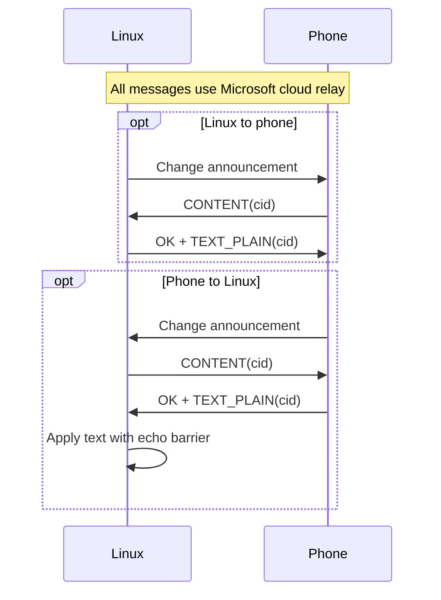

# Clipboard wire and state reference

[Documentation index](../README.md)

The Linux runtime transfers plain text, HTML fragments and PNG images. Probe output and diagnostics report byte counts and MIME types, not content.

Related evidence: [research findings](../research/findings.md), [historical validation](../research/validation.md), and [development history](../research/history.md).

## Start here: two directions, two exchanges

| Direction | Exchange |
| --- | --- |
| Linux to phone | Announce a change → receive the phone's CONTENT request → return the correlated content. |
| Phone to Linux | Receive an announcement → request CONTENT → apply the correlated response locally. |

These are logical peers; all messages pass through Microsoft's cloud relay.

<details>
<summary>Two-way publication and CONTENT sequence</summary>



</details>

The outbound Linux publication and inbound phone publication use different wrappers:

<details>
<summary>Publication wrappers and routes in plain text</summary>

```text
Linux clipboard change
  -> ClipboardResponseMessage { status: CLIPBOARD_CHANGE, correlation_id }
  -> PubSubPayload.Data
  -> MSAEP { message_tag: 9, dcg_client_id, message_id, payload, platform 1.1 }
  -> PLATFORM /Context/Publish
  -> DCG transport type Platform
  -> Hub Relay

phone-to-Linux publication
  -> PubSubPayload.Additional
  -> CLIPBOARD_CHANGE correlation_id
  -> PLATFORM /DeviceResourceManager GET /clipboard CONTENT
  -> PLATFORM /internal/response with _originalRequestId
  -> ClipboardResponseMessage OK + IMAGE / TEXT_HTML / TEXT_PLAIN item
  -> Linux clipboard backend
```

</details>

For phone-to-Linux publication, the phone puts the serialized change response in `PubSubPayload.Additional`, not `Data`. The Linux client preserves that correlation ID and immediately requests `CONTENT`; it does not issue `STATUS` on this receive path. Feature state is separate and uses `FEATURE_ON`, `FEATURE_OFF`, or `FEATURE_DISABLE`. Directional constructors and parsers are in [`protocol/clipboard/pubsub.go`](../../protocol/clipboard/pubsub.go#L8-L32).

## Contract at a glance

| Concern | Implemented behavior |
| --- | --- |
| Wire direction | PC publication uses `PubSubPayload.Data`; phone publication uses `Additional`. A phone publication containing only `Data` is rejected. |
| Clipboard type | The Linux feature accepts successful `IMAGE`, `TEXT_HTML` and `TEXT_PLAIN` responses. Rich native providers advertise and apply all three; `xsel` advertises text only. |
| Resource request | Clipboard uses `UNKNOWN=4`, `GET=1`, and resource path `/clipboard`. |
| Correlation | PLATFORM `_requestId` matches `_originalRequestId`; inner clipboard correlation must also match. |
| Snapshots | Exact published content is retained for two minutes, up to 64 entries and 16 MiB total. Retired IDs are bounded to 256 entries and have no time expiry. |
| Stale content | Known retired or superseded IDs return `INVALID_CONTENT` with `ErrorType=REJECT`. The bounded retirement history and unknown-ID fallback are explained below. |
| Ordering | One generation domain covers local and remote changes. New remote generations cancel older pulls and supersede older versioned local snapshots. |
| Echo | The origin barrier lasts 3 seconds. Hashes include content type and full desktop bytes. Plain-text comparison normalizes CRLF/LF and one terminal newline while publication preserves its original text. |
| Safety | CLI probes never print clipboard text, explicit probe text is limited to 4096 bytes, and sensitive command-line arguments can remain in shell history. |

## Protobuf-compatible messages

The repository uses hand-written protobuf-compatible codecs. Unknown fields are skipped; malformed varints, lengths, and wire types return `ErrMalformed`. Field numbers and Go fields are in [`protocol/clipboard/types.go`](../../protocol/clipboard/types.go#L3-L129); encoding is in [`protocol/clipboard/codec.go`](../../protocol/clipboard/codec.go#L3-L330).

### ClipboardRequestMessage

<details>
<summary>Request fields, enum values, and constructors</summary>

| Field          | Number | Wire type        | Go field        |
| -------------- | -----: | ---------------- | --------------- |
| request type   |      1 | varint           | `Type`          |
| correlation ID |      2 | length-delimited | `CorrelationID` |

| Request enum      | Value |
| ----------------- | ----: |
| `Unspecified`     |     0 |
| `CONTENT`         |     1 |
| `FEATURE_ON`      |     2 |
| `FEATURE_OFF`     |     3 |
| `FEATURE_DISABLE` |     4 |
| `STATUS`          |     5 |

Constructors are `NewContentRequest`, `NewFeatureOnRequest`, `NewFeatureOffRequest`, `NewFeatureDisableRequest`, and `NewStatusRequest`. A request correlation ID is field 2 and should be preserved by its response. The exact request wire example and round trip are tested in [`protocol/clipboard/codec_test.go`](../../protocol/clipboard/codec_test.go#L10-L23).

</details>

### ClipboardResponseMessage

<details>
<summary>Response fields, status values, and constructors</summary>

| Field                    | Number | Wire type        | Go field        |
| ------------------------ | -----: | ---------------- | --------------- |
| repeated `ClipboardItem` |      1 | length-delimited | `Items`         |
| response status          |      2 | varint           | `Status`        |
| correlation ID           |      3 | length-delimited | `CorrelationID` |
| error type               |      4 | varint           | `ErrorType`     |
| error detail             |      5 | length-delimited | `ErrorDetail`   |

| Response enum                          | Value |
| -------------------------------------- | ----: |
| `Unspecified`                          |     0 |
| `OK`                                   |     1 |
| `INVALID_DEVICE_RESOURCE_REQUEST_TYPE` |     2 |
| `INVALID_DEVICE_RESOURCE_REQUEST_PATH` |     3 |
| `INVALID_CLIPBOARD_REQUEST_TYPE`       |     4 |
| `UNRECOGNIZED_PAYLOAD`                 |     5 |
| `CLIPBOARD_CHANGE`                     |     6 |
| `INVALID_CONTENT`                      |     7 |
| `FEATURE_ON`                           |     8 |
| `FEATURE_OFF`                          |     9 |
| `FEATURE_DISABLE`                      |    10 |

`NewClipboardChange` creates status 6 with a correlation ID. `NewFeatureOnResponse` creates status 8. `NewTextResponse` creates status `OK`, one `TEXT_PLAIN` item, supplied text, and an optional timestamp.

</details>

### ClipboardItem and timestamp

<details>
<summary>Item fields, type values, and timestamp</summary>

| Field               | Number | Wire type                | Go field      |
| ------------------- | -----: | ------------------------ | ------------- |
| item type           |      1 | varint                   | `Type`        |
| plain or other text |      2 | length-delimited string  | `Text`        |
| image bytes         |      3 | length-delimited bytes   | `ImageBytes`  |
| created time        |      4 | length-delimited message | `CreatedTime` |

Item enum values are `UNSPECIFIED=0`, `IMAGE=1`, `TEXT_PLAIN=2`, and `TEXT_HTML=3`. The minimal timestamp has seconds field 1 and nanos field 2. The runtime selects IMAGE, then TEXT_HTML, then TEXT_PLAIN. Text requires field 2 presence, including explicit empty strings. Images are validated and normalized to PNG. Rich native providers advertise HTML/image capabilities. Round trips, unknown fields, malformed lengths, and image items are covered in [`protocol/clipboard/codec_test.go`](../../protocol/clipboard/codec_test.go#L25-L121).

</details>

## PubSub and MSAEP layers

<details>
<summary>PubSub fields, MSAEP envelope, and source evidence</summary>

`PubSubPayload` has two fields:

| Field        | Number | Type  | Direction in this project                  |
| ------------ | -----: | ----- | ------------------------------------------ |
| `Data`       |      1 | bytes | PC-to-phone `CLIPBOARD_CHANGE` publication |
| `Additional` |      2 | bytes | Phone-to-PC `CLIPBOARD_CHANGE` publication |

The selected field contains a serialized `ClipboardResponseMessage`. The project intentionally does not treat the fields as interchangeable. `TestPCClipboardChangePublicationUsesData`, `TestPhoneClipboardChangePublicationUsesAdditional`, and `TestPhoneClipboardChangePublicationRejectsDataOnly` record this boundary in [`protocol/clipboard/pubsub_test.go`](../../protocol/clipboard/pubsub_test.go#L5-L38).

The outer MSAEP message uses tag 9 for clipboard, sender DCG client ID, an envelope message ID, serialized `PubSubPayload`, and platform protocol version 1.1. `protocol/msaep/message.go` documents fields 1 through 6 and the default version in [`protocol/msaep/message.go`](../../protocol/msaep/message.go#L1-L50). The PC publisher builds the sequence in [`clipboard/client.go`](../../clipboard/client.go#L178-L203).

</details>

## PLATFORM resource framing

<details>
<summary>PLATFORM headers and resource wrapper fields</summary>

Clipboard traffic uses PLATFORM version 1 and these headers:

```text
ms-content-type: application/x-binary
_route: /Context/Publish                 # publication
_route: /DeviceResourceManager           # resource request
_route: /internal/response               # resource response
_rejectionVersion: 1
_requestId: <request envelope ID>        # request
_originalRequestId: <request envelope ID> # response
```

The binary layout, headers, and route constructors are in [`protocol/platform/message.go`](../../protocol/platform/message.go#L14-L192). `NewContextPublish` is one-way at the application level. The relay still waits for the DCG fragment ACK; a `/DeviceResourceManager` request waits for a separate `/internal/response`.

A device-resource message has:

| Field         | Number | Value                                |
| ------------- | -----: | ------------------------------------ |
| resource type |      1 | `UNKNOWN=4` for clipboard            |
| request type  |      2 | `GET=1` for clipboard requests       |
| payload       |      3 | serialized `ClipboardRequestMessage` |
| resource path |      4 | `/clipboard`                         |

The DeviceResourceManager request enum also defines `UNSPECIFIED=0`, `UPDATE=2`, `DELETE=3`, and `SYNC=4`. The response wrapper has payload field 1 and response type field 2. Response types are `UNSPECIFIED=0`, `Success=1`, and `ResourceHandlerNotRegistered=2`. Wrappers are in [`protocol/clipboard/types.go`](../../protocol/clipboard/types.go#L86-L129) and [`protocol/clipboard/codec.go`](../../protocol/clipboard/codec.go#L270-L419).

</details>

## STATUS, FEATURE_ON, and CONTENT

A Windows-compatible resource handler answers `STATUS` with `DeviceResourceResponse.Success` and a `ClipboardResponseMessage` whose status is `FEATURE_ON`, using the request correlation ID. It answers `CONTENT` with `Success` plus a text response using the same correlation ID. Unsupported paths, non-GET operations, and unknown request types receive `ResourceHandlerNotRegistered` or an invalid request status as appropriate.

<details>
<summary>Observed STATUS negotiation and finite probe evidence</summary>

The production probe observed this sequence after a PC `CLIPBOARD_CHANGE` publication:

```text
Context/Publish(tag 9, Data = CLIPBOARD_CHANGE[cid])
  <- phone: GET /clipboard STATUS[cid]
  -> Success + FEATURE_ON[cid]
  <- phone: GET /clipboard CONTENT[cid]
  -> Success + TEXT_PLAIN[cid]
```

A later run requested `CONTENT` directly; the implementation accepts both. A finite probe can answer `CONTENT` with `ResourceHandlerNotRegistered` so it records state progression without sending text. An explicit non-sensitive probe string enables a successful text response. See [`bootstrap/context.go`](../../bootstrap/context.go#L49-L58) and [`bootstrap/context.go`](../../bootstrap/context.go#L180-L297). Focused fake-relay coverage includes state progression, status-only timeout, peer rejection, and explicit-content branches in [`bootstrap/context_test.go`](../../bootstrap/context_test.go#L15-L547).

</details>

The normal client answers inbound resource requests in a worker. It filters by configured peer source, requires `_requestId`, validates `/clipboard` and `GET`, and preserves the request correlation ID. CONTENT uses a live publication snapshot when available. A retained retired correlation or superseded snapshot returns `INVALID_CONTENT`; only an unknown, non-retired, non-superseded correlation can fall back to reading the current local clipboard. See [`clipboard/client.go`](../../clipboard/client.go#L661-L757).

## Correlation IDs and snapshots

| ID | Meaning | Response match |
| --- | --- | --- |
| PLATFORM `_requestId` | Outer request envelope | `_originalRequestId` |
| Clipboard correlation ID | Logical clipboard publication | The same inner value in the request and `ClipboardResponseMessage` |

`clipboard.Client.request` matches the pending response by `_originalRequestId`, then checks that the inner response correlation equals the request correlation. A mismatch is an error, preventing one phone response from completing another local request. See [`clipboard/client.go`](../../clipboard/client.go#L463-L515).

A PC publication records exact content under its correlation ID before sending `CLIPBOARD_CHANGE`. If the desktop clipboard changes before the phone asks for CONTENT, that live correlation still receives the advertised typed content. Snapshots expire after two minutes and are bounded to 64 entries and 16 MiB total. Expired or evicted snapshots are retired. Duplicate CONTENT requests do not retire a live snapshot and return the same snapshot, covering peer retry without replacing it with newer local content. A retained retired correlation returns `INVALID_CONTENT` with `ErrorType=REJECT`. The retired-ID map is bounded to 256 entries and has no time expiry, so rejection is not an unlimited historical guarantee once older tombstones are evicted. See [`clipboard/client.go`](../../clipboard/client.go#L205-L343), [`clipboard/client.go`](../../clipboard/client.go#L361-L405), and [`clipboard/client_test.go`](../../clipboard/client_test.go#L611-L682).

## Generation ordering and tombstones

The modular and continuous paths use one monotonically increasing generation domain for local and remote changes:

1. Reserve a local generation when the native observer sees a change, before the publication worker sends it.
2. Prepare outbound image bytes if needed, then store the typed content snapshot with its generation and correlation ID.
3. Reserve a remote generation when a phone publication arrives.
4. Advance the publication floor and mark older versioned local snapshots as superseded.
5. Cancel an older phone CONTENT pull when a newer phone publication arrives.
6. Before applying a phone response, verify that its generation is still current.

An older local publication remains addressable while the peer may still request its correlation ID. If a newer remote generation supersedes it, a later CONTENT request returns `INVALID_CONTENT` rather than current or stale text. This is a tombstone, not a silent substitution. See [`clipboard/client.go`](../../clipboard/client.go#L229-L291), [`clipboard/generation_test.go`](../../clipboard/generation_test.go#L14-L108), and [`clipboard/generation_order_test.go`](../../clipboard/generation_order_test.go#L36-L136).

The inbound resource-request queue is bounded at 16. The phone publication queue keeps the newest pending publication and cancels the prior pull. Late responses for a canceled request are harmless because the pending request was removed and the generation check blocks stale application. This ordering followed receive/send races and is tested in [`clipboard/client_test.go`](../../clipboard/client_test.go#L446-L568).

## Echo and native clipboard behavior

Phone-to-Linux writes avoid immediate phone-to-Linux-to-phone echo:

- `pullToLocal` reads current typed content and skips a write when its type and bytes already match;
- the feature's origin barrier suppresses previous and incoming content hashes (plain text retains newline normalization) for a three-second remote-write settle window;
- echo comparison normalizes CRLF/LF and one terminal newline while preserving original bytes for protocol payloads;
- phone publication work runs separately from the relay receive loop, so waiting for a DCG ACK does not block receive-side handling.

Native backend selection prefers Wayland `wl-paste`/`wl-copy`; X11 falls back to `xclip`, then `xsel`. Commands execute directly without a shell. The native implementation is in [`clipboard/native.go`](../../clipboard/native.go#L19-L211). Rich providers use MIME polling. The legacy text observer supports `wl-paste --watch` and a hidden helper in the same executable. The helper sends length-delimited frames over pipes, includes `data` or `nil` state, and keeps events separated. See [`clipboard/native_watch.go`](../../clipboard/native_watch.go#L36-L329) and [`clipboard/native_watch_test.go`](../../clipboard/native_watch_test.go#L12-L153).

`wl-copy` forks by default so it can keep owning the selection. Capturing stdout or stderr pipes while waiting can leave the parent blocked until selection changes, so the native write path runs the command without captured output pipes. Wayland compositor handoff can emit transient nil selection before the next data offer; the watcher debounces nil for 100 ms. A following data event cancels the clear; a genuine clear publishes one empty value after debounce. These are implementation and historical live-validation details, not protocol fields. Rich Wayland and X11 providers use MIME polling at 500 ms by default; empty selections are re-read after debounce.

No clipboard text is printed by the CLI. Documented probes limit explicit probe content to 4096 bytes and report only byte counts. Do not use sensitive text in command-line arguments because shell history can retain it.

## Supported wire versus implemented feature

The native runtime supports text, HTML and images through wl-clipboard and xclip; xsel remains text-only. Protocol enum values, platform version, message tag, and resource enum values are compatibility constants. They do not establish full Phone Link parity, arbitrary resource operations, or support for a specific phone model.

The feature depends on Microsoft cloud services and a linked peer. Long-running relay reconnect, wake recovery, and token-refresh resilience remain open. A successful finite CONTENT exchange does not establish indefinite synchronization after sleep, network loss, or token expiry.

Incoming IMAGE bytes use the 16 MiB encoded-input budget and 33554432-pixel limit before PNG normalization. Incoming conversion preserves decoded dimensions. Desktop PNG output has a separate 128 MiB safety budget; it is not constrained by the 1 MiB outbound transfer limit. Native reads retain that full representation for echo suppression. Every outbound image, including live CONTENT request fallback, is prepared as PNG within 1 MiB before transmission. Registered decoders are PNG, JPEG, GIF and BMP.

HTML and image support has live owner reports on Wayland/S23; [validation](../research/validation.md#clipboard-validation-2026-10-03) separates those reports from automated codec and transport tests. Incoming dimension parity with Windows was observed for one image. Outbound encoding shares the PNG/1 MiB contract but uses independent resampling and size selection, so exact Windows output parity is not promised.
