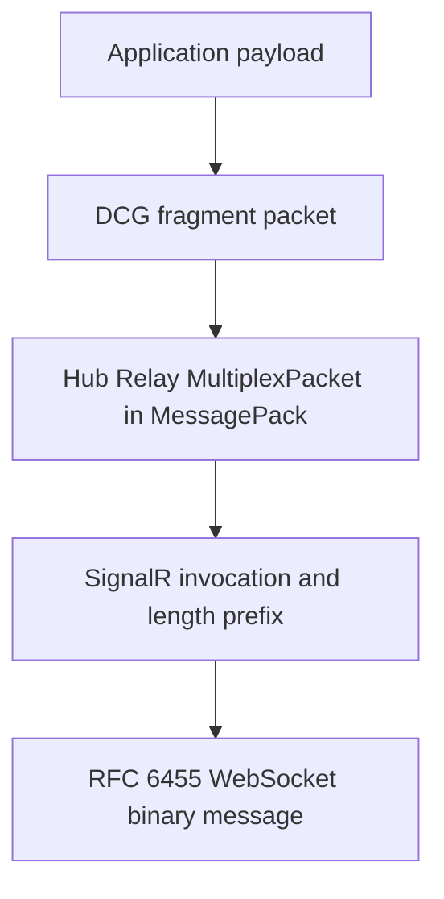

# Transport and message reference

[Documentation index](../README.md)

A packet can be valid at one layer and fail at another. Name the first boundary that rejected it when diagnosing a failure.

Related evidence: [research findings](../research/findings.md), [historical validation](../research/validation.md), and [development history](../research/history.md).

## Start here: message path and acknowledgements

The outer wire stack is:



A normal Linux clipboard publication crosses the layers in this order:

```text
ClipboardResponseMessage(CLIPBOARD_CHANGE)
  -> PubSubPayload
  -> MSAEP message tag 9
  -> PLATFORM /Context/Publish
  -> DCG PLATFORM fragments
  -> Hub Relay SignalR
```

A phone publication reverses the outer path, carries its clipboard change in `PubSubPayload.Additional`, and uses a separate `/clipboard` CONTENT request. Implementations are in [`protocol/`](../../protocol/), [`transport/signalr/`](../../transport/signalr/), and [`transport/relay/`](../../transport/relay/).

Each outgoing fragment has two independent results:

1. **Hub Completion:** SignalR accepted or rejected `SendMessageAsync`.
2. **Peer DCG ACK:** the peer processed the fragment envelope and returned `Success` or an error number.

A successful peer ACK may complete a send before Hub Completion arrives. `Success=false`, a Hub rejection received first, and context cancellation fail immediately without fragment retry. Only an attempt timeout advances the bounded retry loop. A Hub rejection is never reported as a peer ACK.

## Identifier map

Do not substitute one identifier for another:

| Identifier | Scope | Where it appears |
| --- | --- | --- |
| DCG client ID | Cloud device identity | Hub target/source, MSAEP `DcgClientID`, trust relationships |
| DCG `SessionId` | Per-target DCG message session by default | Fragment and ACK properties; when omitted, the relay generates one stable UUID per target for its lifetime. `Send` also accepts an explicit non-empty session ID. |
| SignalR invocation ID | One Hub invocation and its completion | SignalR invocation array element 2 and Completion element 2 |
| Hub `connectionSessionId` | Optional session-based Hub method argument | `SendSessionBasedMessageAsync` argument 4 and `OnReceiveSessionBasedMessage` argument 4 |
| PLATFORM `_requestId` | One platform request envelope | Request headers, matched by `_originalRequestId` in `/internal/response` |
| Clipboard correlation ID | One logical clipboard publication/request | Clipboard protobuf field 3, preserved from `CLIPBOARD_CHANGE` through CONTENT |
| MSAEP `MessageID` | One cloud PubSub envelope | MSAEP field 3 |

`transport/relay/client.go` keeps DCG session IDs keyed by target and creates a UUID on the target's first send. The optional Hub session ID is passed separately to the session-based method. See [`transport/relay/client_test.go`](../../transport/relay/client_test.go#L331-L354) and [`protocol/signalr/invocation_test.go`](../../protocol/signalr/invocation_test.go#L78-L123).

## SignalR WebSocket transport

### Negotiate and handshake

`transport/signalr.Dial` posts to `<hub>/negotiate?negotiateVersion=1` with the DCG bearer token and source-compatible headers. It follows up to four redirects, requires a connection token, and requires a `WebSockets` transport with `Binary` transfer format. It converts `http` to `ws` and `https` to `wss`, then adds the negotiated token as the `id` query parameter. See [`transport/signalr/client.go`](../../transport/signalr/client.go#L19-L115) and [`transport/signalr/client.go`](../../transport/signalr/client.go#L140-L208).

The client sends this text handshake record:

```text
{"protocol":"messagepack","version":1}<record separator>
```

The server response must contain a JSON record followed by byte `0x1e`. It may arrive as a text or binary WebSocket message. If binary data follows the separator, the client retains those bytes as the first Hub payload. Production observed the handshake and first Hub record coalesced in one binary message. Text handshake data with trailing Hub bytes is rejected, because that framing shape is unsupported. The parser and regression tests are in [`transport/signalr/client.go`](../../transport/signalr/client.go#L97-L137) and [`transport/signalr/client_test.go`](../../transport/signalr/client_test.go#L21-L111).

After the handshake, binary WebSocket messages are accepted and text messages are rejected. `ReadBinary` returns retained coalesced bytes before reading the socket again. WebSocket implementation details and masking tests are in [`transport/wsclient/`](../../transport/wsclient/).

### SignalR framing and Hub values

Each MessagePack Hub record has a variable-length unsigned 32-bit length prefix. [`protocol/signalr/length.go`](../../protocol/signalr/length.go#L7-L60) validates the prefix, and `SplitFrames` accepts multiple records in one WebSocket payload.

| Hub message type  | Value |
| ----------------- | ----: |
| Invocation        |     1 |
| Stream item       |     2 |
| Completion        |     3 |
| Stream invocation |     4 |
| Cancel invocation |     5 |
| Ping              |     6 |
| Close             |     7 |

A Hub invocation is a six-element array:

```text
[messageType, headers, invocationId, target, arguments, streamIds]
```

The parser validates this shape and decodes nullable invocation IDs. See [`protocol/signalr/decode.go`](../../protocol/signalr/decode.go#L14-L117).

## Hub Relay methods and trace context

Normal DCG traffic uses `SendMessageAsync`, including normal PLATFORM traffic:

```text
[1, {}, invocationId, "SendMessageAsync", [trace, targetDcgClientId, packet], []]
```

Session-based traffic is separate:

```text
[1, {}, invocationId, "SendSessionBasedMessageAsync",
 [trace, targetDcgClientId, packet, connectionSessionId], []]
```

Presence uses:

```text
[1, {}, invocationId, "SendConnectedAsync", [trace, targetDcgClientId, {}], []]
```

Outbound shapes and packet map keys are serialized by [`protocol/signalr/invocation.go`](../../protocol/signalr/invocation.go#L12-L126). Receive targets are `OnConnected`, `OnPartnerConnected`, `OnPartnerDisconnected`, `OnReceiveMessage`, and `OnReceiveSessionBasedMessage`; receive arguments are parsed in [`protocol/signalr/decode.go`](../../protocol/signalr/decode.go#L120-L321).

`OnConnected` carries `RegionName` and a `Partners` list. `OnPartnerConnected` carries source DCG ID, optional trace map, and optional region. The two receive-message targets carry source ID, trace, packet, and, for the session-based target, a separate connection session ID.

Every modeled outbound Hub Relay invocation carries a non-null trace object:

```text
ParentId   nullable string, normally 16 hex characters
TraceFlags integer, normally 0
TraceId    nullable string, normally 32 hex characters
TraceState  non-null map, normally empty
```

`NewTraceContextPacket` generates 16 random bytes for `TraceId` and 8 random bytes for `ParentId`, encoded as lowercase hex. `NormalizeTraceContextPacket` fills missing or incorrectly sized IDs and replaces nil `TraceState` with an empty map. See [`protocol/signalr/trace.go`](../../protocol/signalr/trace.go#L9-L74) and [`protocol/signalr/trace_test.go`](../../protocol/signalr/trace_test.go#L5-L30).

An empty trace object was an observed interoperability failure: the receiver could fail before processing the DCG packet, so no DCG ACK appeared. The project normalizes traces for fragments, ACKs, presence, and pre-wake presence flushes. This source-compatible requirement is recorded in [`research findings`](../research/findings.md#trace-context-shape).

## Completion, ACK, and retry behavior

Hub invocations carry an invocation ID. A SignalR `Completion` has result kind `Error=1`, `Void=2`, or `Value=3`; parsing is in [`protocol/signalr/completion.go`](../../protocol/signalr/completion.go#L8-L66).

The relay tracks Hub Completion and peer ACK independently. A Hub rejection is reported as a Hub Relay error. If Hub Completion succeeds but peer ACK does not arrive before retries finish, diagnostics say the Hub accepted the send but peer DCG acknowledgement timed out. A timeout before either result is reported separately. This is implemented in [`transport/relay/client.go`](../../transport/relay/client.go#L337-L420) and exercised by [`transport/relay/client_test.go`](../../transport/relay/client_test.go#L509-L644).

## DCG envelope

The DCG handler type is `ms-dcg`. A fragment `MultiplexPacket` has three top-level fields:

| Field        | Type          | Meaning                                  |
| ------------ | ------------- | ---------------------------------------- |
| `Properties` | map           | Fragment or ACK metadata                 |
| `Raw`        | binary or nil | Fragment payload; ACKs have nil raw data |
| `Type`       | string        | `ms-dcg`                                 |

Fragment property names are case-sensitive:

| Property | Fragment meaning |
| --- | --- |
| `Version` | `1` |
| `Type` | DCG packet message type, normally `Fragment=2` |
| `SessionId` | DCG session identity |
| `SequenceNumber` | Per-target send sequence, starting at 1 |
| `MessageId` | Message identity shared by all fragments |
| `FragmentId` | One-based fragment number |
| `FragmentCount` | Total fragments |
| `MessageType` | Hub Relay transport type, `App=0`, `Platform=1`, or `Unknown=2` |

An acknowledgement may carry `ErrorNo` and `ErrorMessage` when `Success` is false. `ErrorNo` is parsed into `Ack`; the current parser retains `ErrorMessage` only as a property name and does not expose it in `Ack`. These peer DCG details are distinct from a SignalR Completion error.

DCG packet type values are separate from Hub Relay transport values:

| DCG packet type      | Value |
| -------------------- | ----: |
| Unspecified          |     0 |
| Acknowledgement      |     1 |
| Fragment             |     2 |
| PresenceAnnouncement |     3 |
| PresenceRequest      |     4 |
| PresenceResponse     |     5 |

The ACK has `Version=1`, `Type=1`, `SessionId`, `SequenceNumber`, `Success`, and optional `ErrorNo`. A successful ACK has `Success=true` and `ErrorNo=0`. The parser requires handler type, version, packet type, sequence, success, and a non-empty session ID. See [`protocol/dcg/constants.go`](../../protocol/dcg/constants.go#L3-L30), [`protocol/dcg/fragment.go`](../../protocol/dcg/fragment.go#L10-L81), and [`protocol/dcg/packet.go`](../../protocol/dcg/packet.go#L11-L122).

The `MessageType` property is a compatibility boundary. Hub Relay `TransportMessageType` is `App=0`, `Platform=1`, `Unknown=2`; a separate protobuf enum is `Unspecified=0`, `App=1`, `Platform=2`. Hub Relay packets use the first enum. Copying protobuf values into `Properties["MessageType"]` mislabels traffic. The wire-value test is [`protocol/dcg/packet_test.go`](../../protocol/dcg/packet_test.go#L48-L58).

### Fragmentation, reassembly, and ordering

`FragmentPayload` splits a payload into configured chunks, keeps one fragment for an empty payload, numbers fragments from 1, and copies each payload slice. Relay defaults are 64 KiB fragments, a 5 second ACK timeout, and two retries. Sends serialize per target, increment a per-target sequence for each fragment, and retain that sequence while retrying the same fragment. Reassembly defaults are a 32 MiB limit and 4096 fragments.

Reassembly keys on source DCG ID, DCG `SessionId`, `MessageId`, and transport message type. It accepts out-of-order fragments, rejects changed fragment counts and conflicting duplicate payloads, enforces total size/count limits, and deletes a completed message. See [`protocol/dcg/packet.go`](../../protocol/dcg/packet.go#L173-L257) and [`protocol/dcg/fragment_test.go`](../../protocol/dcg/fragment_test.go#L8-L70).

When a complete incoming fragment arrives, the relay sends a successful DCG ACK before delivering the reassembled payload to the bounded application queue. The receive event contains source, DCG session ID, message ID, transport type, and payload. The relay read loop must run while sends wait for ACKs. A closed or malformed Hub read loop fails the relay; a full application queue fails fast rather than silently dropping traffic. See [`transport/relay/client.go`](../../transport/relay/client.go#L107-L196) and [`transport/relay/client.go`](../../transport/relay/client.go#L422-L475).

## Shared APP/PLATFORM framing

APP and PLATFORM share a binary envelope with version byte `1`; their payload contracts and transport message types remain distinct:

```text
byte 0: version
uint32 little-endian: header byte length
uint32 little-endian: header count
header section: repeated uint32 length + UTF-8 bytes for key, then value
uint64 little-endian: payload length
payload bytes
```

The parser bounds header count by actual input, validates payload length, and rejects trailing bytes. Android advertises the key/value byte length without the four-byte header count; Windows includes that count. Exactly those two verified conventions are accepted. `platform.Marshal` preserves the Android convention used by existing PLATFORM callers; `platform.MarshalWithHeaderCount` emits the Windows convention for APP producers.

| Header               | Purpose                                     |
| -------------------- | ------------------------------------------- |
| `ms-content-type`    | `application/x-binary` for these messages   |
| `_route`             | Route selector                              |
| `_rejectionVersion`  | `1`                                         |
| `_requestId`         | Request envelope identity                   |
| `_originalRequestId` | Request ID answered by `/internal/response` |
| `_rejectedReason`    | Optional peer rejection reason              |

Routes modeled in [`protocol/platform/message.go`](../../protocol/platform/message.go#L14-L29) are `/DeviceResourceManager`, `/internal/response`, `/Context/Publish`, and `/SessionValidation`. Constructors and exact layout are in [`protocol/platform/message.go`](../../protocol/platform/message.go#L33-L192), with layout, route, and rejection tests in [`protocol/platform/message_test.go`](../../protocol/platform/message_test.go#L9-L108).

A successful response is matched by route and `_originalRequestId`; neither the DCG ACK nor SignalR Completion replaces this application-level correlation.

## MSAEP PubSub envelope

The MSAEP protobuf envelope has these fields:

| Field                    | Number | Type   |
| ------------------------ | -----: | ------ |
| `message_tag`            |      1 | int32  |
| `dcg_client_id`          |      2 | string |
| `message_id`             |      3 | string |
| `payload`                |      4 | bytes  |
| `platform_major_version` |      5 | int32  |
| `platform_minor_version` |      6 | int32  |

New envelopes default to platform version `1.1`. Clipboard uses message tag `9`. The schema and codec are in [`protocol/msaep/message.go`](../../protocol/msaep/message.go#L1-L123); clipboard payloads are serialized `PubSubPayload` values described in [`clipboard.md`](clipboard.md).

## Failure boundaries

Use the first failing layer to classify a failure:

| Boundary | Typical failure | Retry behavior |
| --- | --- | --- |
| WebSocket or negotiate | No binary WebSocket, invalid handshake, read failure | Account bootstrap (`OpenCloudRelay`) tries assigned shards during setup; SignalR `Dial` negotiates one endpoint. The runtime supervisor reopens failed sessions; SignalR adds keepalive and server-silence deadlines. |
| SignalR frame or MessagePack | Invalid length, malformed record, unexpected text after handshake | Fail the relay read loop |
| Hub Completion | `SendMessageAsync` rejected | Return a Hub rejection; do not call it a peer ACK |
| DCG ACK | `Success=false`, missing ACK, or timeout | Negative ACK fails immediately. Timeout retries retain the sequence and stop at retry count or context cancellation. |
| DCG reassembly | Bounds, duplicate mismatch, count change, size limit | Reject and reset the affected partial message |
| PLATFORM | Unsupported version, malformed headers, trailing bytes | Reject that payload |
| Application response | Wrong route, source, request ID, or clipboard correlation | Ignore unrelated messages while explicitly waiting, or return a correlation error for its own response |

The [session supervisor](../architecture/session-resilience.md) adds whole-session recovery to finite fragment retries and shard selection. A failed in-flight CONTENT exchange is not replayed into the next generation. Live reconnect, wake/re-presence and long-session token renewal still need validation.
