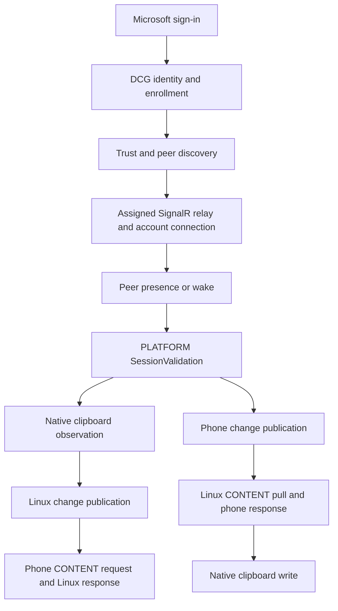

# Research method and provenance

[Documentation index](../README.md)

Use the smallest probe that answers the question, record the boundary that failed, and keep source, test, commit, and live evidence distinct.

## What the repository preserves

| Evidence | What it establishes |
| --- | --- |
| Go source and source comments | Implemented wire shape, control flow, constants, and stated upstream correspondence |
| Deterministic tests | Behavior under the test's inputs and simulated peers, clocks, processes, or HTTP services |
| Commit history | When an implementation or correction entered the repository, and the exact diff |
| Written live reports | Results reported for the tested Microsoft services, S23, Wayland desktop, and systemd session |

The original reports remain available in the [pre-restructure README](https://github.com/YMGPwcca/phonelink-linux/blob/e51728b12a148061c8076c67200ee4a8f366e423/README.md), [module-system notes](https://github.com/YMGPwcca/phonelink-linux/blob/e51728b12a148061c8076c67200ee4a8f366e423/docs/architecture/MODULE_SYSTEM.md), and [systemd notes](https://github.com/YMGPwcca/phonelink-linux/blob/e51728b12a148061c8076c67200ee4a8f366e423/docs/operations/SYSTEMD.md). [Findings](findings.md), [history](history.md), and the [validation record](validation.md) separate those reports from current implementation contracts.

[PR #1](https://github.com/YMGPwcca/phonelink-linux/pull/1) contains earlier implementation notes. Parts of its description still list bootstrap validation, session setup, and the Linux clipboard backend as unfinished, although later commits and the recorded README describe them working. Follow the commit-linked history when the records disagree.

Historical commit, blob, and PR links intentionally retain the original `phonelink-linux` repository URL and original artifacts. Current command examples use LinkMyPhone names; the rename does not change the observations or Microsoft wire values recorded in those artifacts.

The repository does not preserve the decompiled Windows source corpus, original `.proto` files, raw production captures, or a complete investigation transcript. The reported compatibility profile was CrossDevice app `1.26072.116.0`, ring `Public`, and advertised OS version `10.0.26100`. No package hash or source-extraction transcript is recorded here. A statement described historically as "source-confirmed" must retain its written/source-comment citation; it cannot be independently checked against the original binary from this checkout alone.

## Choose the smallest probe

Run probes only with an account and devices you control. They contact production services and can enroll a client, wake a phone, or change a clipboard.

| Question | Starting point | Side effect or boundary |
| --- | --- | --- |
| Can the account enroll or resume? | `bootstrap-probe` | First use creates persistent enrollment and credentials; later use resumes them. |
| Can the linked Android peer become present? | `peer-probe` | Can send a signed wake request. Presence does not prove PLATFORM or clipboard handling. |
| Does the peer answer session validation? | `session-probe` | Sends `/SessionValidation`; does not intentionally copy clipboard text. |
| Does a publication cause STATUS or CONTENT? | `session-probe --context-probe` | Announces a clipboard change and answers STATUS; without explicit text, CONTENT is rejected. |
| Can explicit text reach the phone? | `session-probe --context-probe --context-text "probe text"` | Intentionally supplies phone clipboard text; the argument can remain in shell history. |
| Do native clipboard changes flow both ways? | Enabled `linkmyphone.clipboard` plus `run` | Subsequent plain-text changes are synchronized until the module stops. |
| Do desired-state changes reconcile live? | `feature` commands while `run` owns the same store | Enable, disable, update, and delete affect the running module. |

See [CLI options](../reference/cli.md), [first-run setup](../getting-started/first-run.md), and the [stage-by-stage validation procedure](validation.md) for complete commands and prerequisites. Do not run a second foreground runtime beside the user service against the same feature store.

## Record the baseline

Before an experiment, record code and toolchain:

```bash
git rev-parse HEAD
go version
```

Also record Linux distribution, compositor or X11 session, clipboard-provider version, phone model, Android version, Link to Windows version, and compatibility-profile overrides. A phone's Android version and the client's advertised `--os-version` are different fields.

Record which authentication state and feature store were used. In a public report, replace private paths, account identifiers, phone names, and device IDs with stable labels. Do not delete a working enrollment to manufacture a first-run test. An invalid existing state is an error to investigate, not permission to create another identity.

Use harmless test text with a unique run label. Never copy passwords, tokens, recovery codes, personal messages, or private source excerpts during a synchronization test. Do not put credentials in command-line flags or fixtures. The [privacy guide](../operations/privacy-and-state.md) covers local secrets and log redaction.

## Identify the failed boundary

Find the first failed boundary: **sign-in → enrollment → trust → relay → peer wake → SessionValidation**. Clipboard work branches after session validation:

| Direction | Next boundaries |
| --- | --- |
| Linux to phone | Native observation → change publication → phone CONTENT request → text response. |
| Phone to Linux | Phone publication → Linux CONTENT pull → phone response → native write. |

<details>
<summary>Full investigation boundary chart</summary>



</details>

For transport experiments, record acknowledgements separately:

- A WebSocket write proves only that bytes were written locally.
- A Hub `Completion` answers the SignalR invocation; it does not prove that the peer processed the DCG payload.
- A peer DCG ACK confirms the DCG delivery stage; it does not prove a successful clipboard CONTENT response or native paste.
- A correlated PLATFORM/clipboard response proves the application exchange reached that stage.
- A manual paste on the receiving desktop or phone establishes the visible clipboard result.

Do not collapse these observations into "the send succeeded." This distinction led to the [Hub completion, packet enum, and trace-context findings](findings.md).

When a hypothesis depends on wire bytes, reduce it to a redacted deterministic fixture that preserves relevant field numbers, types, lengths, and correlation relationships. If changing the bytes would invalidate the experiment, keep the original artifact private and describe sensitive fields and storage restrictions. A round trip between two copies of the same codec is insufficient evidence of compatibility with an independent peer.

## Write a finding that can be reviewed

Use a record with enough detail to repeat the experiment:

```text
Question:
Code commit:
Build toolchain:
Linux / session / clipboard tool:
Phone / Android / Link to Windows:
Advertised app version / ring / OS version:
Relevant options and feature configuration:
Prerequisite state (redacted):
Exact reproduction commands (non-sensitive):
Expected result:
Observed result and failing stage:
Attempts and outcomes:
Hypothesis and competing explanations:
Source or protocol reference:
Evidence artifact location and access restrictions:
Implementation change:
Regression test and the bug it catches:
Follow-up validation:
Remaining uncertainty:
```

A source inspection, test, and production observation can support one finding, but each must say what it proves. Preserve a negative result when it explains a later change. Keep the original observation when correcting an interpretation, and link the corrective commit.

For an upstream-source observation, record package version and hash, type/method or message definition, and extraction method when those artifacts are available. If unavailable, cite the historical report and say which upstream detail cannot be checked. Do not invent a file path, symbol, capture, or successful experiment to close that gap.

Update [findings](findings.md) for the discovery, [history](history.md) for the corrective commit, and [validation](validation.md) for the experiment's environment and outcome. User-visible changes also need their guide or reference updated.

## Public protocol references

These references explain public framing and authentication layers. They do not specify Microsoft's private DCG routes, Phone Link clipboard contracts, or Hub Relay packet conventions.

- [Microsoft identity-platform device authorization grant](https://learn.microsoft.com/en-us/entra/identity-platform/v2-oauth2-device-code): device-code requests, token polling, expected errors, and refresh-token issuance.
- [SignalR Hub Protocol specification](https://github.com/dotnet/aspnetcore/blob/main/src/SignalR/docs/specs/HubProtocol.md): JSON handshake, MessagePack messages, invocation IDs, and completions.
- [Protocol Buffers wire encoding](https://protobuf.dev/programming-guides/encoding/): field tags, varints, length-delimited values, and wire types.
- [W3C Trace Context recommendation](https://www.w3.org/TR/2021/REC-trace-context-1-20211123/): distributed trace identifiers and HTTP propagation conventions. The Hub Relay trace packet shape is documented separately in the [transport reference](../protocol/transport.md).

For implemented Phone Link contracts, begin with the [source map](../developer/source-map.md) and the [protocol references](README.md#follow-a-message).
