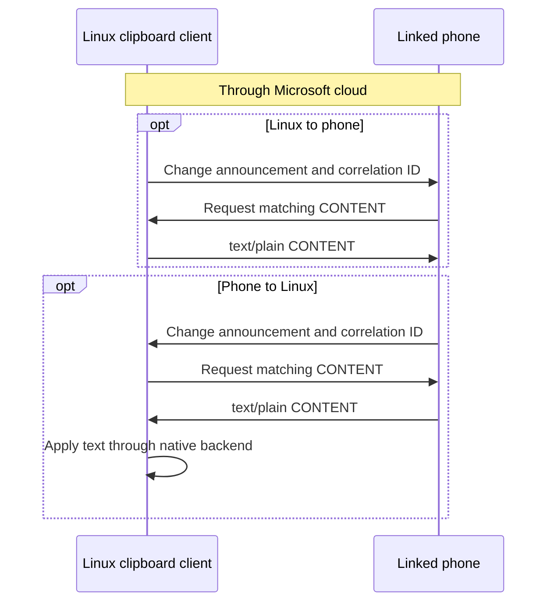

# Clipboard synchronization

[Documentation index](../README.md)

`phonelink.clipboard` synchronizes bidirectional text clipboard changes with one selected linked peer. Default target selection requires exactly one linked Android device; an explicit selector can match another linked device, but recorded clipboard validation covers an S23 only. The feature uses Microsoft's DCG and SignalR cloud services. It does not synchronize arbitrary files or provide clipboard history.

## Start syncing

Create the persistent feature record and run the modular host:

```bash
phonelink-linux feature create --enabled phonelink.clipboard
phonelink-linux run
```

The feature record is persistent. `run` reads enabled records from `~/.config/phonelink-linux/features.json` and starts them after the shared Phone Link host reaches SessionValidation. To start it later, use `feature enable` and leave the host running, or start `run` again.

The compatibility command remains available:

```bash
phonelink-linux clipboard-sync
```

It starts the same `phonelink.clipboard` module through the modular lifecycle, with an in-memory enabled record. It does not create or modify `features.json`.

Feature permission entries such as `clipboard.local.read`, `clipboard.local.write`, and `network.dcg` are manifest metadata. They describe what the module requests; they are not an operating-system sandbox.

## Choose the local clipboard backend

At startup the module reads the current local text clipboard. Backend selection is deterministic:

| Order | Conditions | Backend |
| --- | --- | --- |
| 1 | Wayland session with `wl-paste` and `wl-copy` | `wl-clipboard`, with event watching through `wl-paste --watch` |
| 2 | X11 session with `xclip` | `xclip` |
| 3 | X11 session with no `xclip`, but `xsel` is available | `xsel` |
| 4 | Session variables are missing, but a complete provider is installed | First complete provider in Wayland, `xclip`, `xsel` order |

Wayland watching is event-driven. The helper process frames clipboard text and state back to the current executable without a shell. X11 providers do not advertise native watching here, so the module uses polling when the selected backend has no watcher or when the watcher exits.

If no provider is available, the module cannot start and reports `no supported Linux clipboard backend found; install wl-clipboard, xclip, or xsel`. If a provider is installed but the graphical session is inaccessible, its read or write error is reported. A provider does not replace a valid `WAYLAND_DISPLAY`, `DISPLAY`, or session environment.

Text is limited to 4 MiB for native reads, writes, and watcher frames. Binary clipboard formats are not handled by this feature.

## Choose whether startup publishes the clipboard

The default configuration has `publish_initial: false`. Startup reads the current Linux clipboard so the module can track it, synchronizes feature state with the phone, and then waits for a new local event. It does not publish existing text merely because the module started.

To publish the current local text once at startup, set `publish_initial` in the feature configuration:

```bash
phonelink-linux feature update --config '{"publish_initial":true}' phonelink.clipboard
```

The update replaces the entire configuration object. Include every non-default value you want to retain. The same setting can be supplied to the compatibility command:

```bash
phonelink-linux clipboard-sync --publish-initial
```

An empty clipboard is valid. Wayland's `wl-paste` result `Nothing is copied` is normalized to empty text during initial read. A transient null offer during Wayland ownership handoff is debounced for 100 milliseconds; a following data event cancels the transient clear, while a genuine clear becomes one empty publication after the debounce.

## How changes move

| Direction | Exchange |
| --- | --- |
| Linux to phone | Announce new text → phone requests matching CONTENT → Linux returns the saved text. |
| Phone to Linux | Receive a phone announcement → request matching CONTENT → apply the returned text locally. |

Both exchanges use Microsoft's DCG / SignalR relay.

<details>
<summary>Two-way message sequence</summary>



</details>

The phone-to-Linux path receives the phone's clipboard publication, requests the matching CONTENT payload, and writes the returned text through the selected native backend. The client snapshots outbound text by correlation ID so a CONTENT request answers the advertised change even if the desktop clipboard changes before the request arrives.

The protocol client handles the peer's clipboard resource sequence `STATUS`, `FEATURE_ON`, and `CONTENT`, including a direct `CONTENT` request on a later run. `FEATURE_ON` and `FEATURE_OFF` are synchronization messages, not a permission sandbox.

Published snapshots are retained for later correlation requests for up to two minutes, with a maximum of 64 snapshots. Retired correlation IDs are bounded to 256 entries and do not expire by time. Unknown-correlation fallback excludes retired or superseded IDs, and duplicate requests do not retire an active snapshot. If a newer remote generation supersedes an older in-flight publication, a later CONTENT request for that old correlation is rejected instead of receiving unrelated current text.

An ACK success can complete a send before Hub Completion arrives. A negative ACK, rejection, or cancellation fails the send without retry.

The module uses one generation sequence for local and phone observations. A newer observed change supersedes older queued protocol work. A local publisher queue keeps the latest pending local change, and incoming phone publications coalesce to the latest request while older pulls are canceled. A phone-applied change removes only older queued local work. A local copy observed after that phone event remains eligible for publication.

Phone-to-Linux writes use an origin barrier while the native write and compositor settle. The previous and incoming text hashes are suppressed for three seconds, so the reflected local event does not immediately publish the same text back to the phone. Echo tracking treats CRLF and LF, and a single terminal newline, as equivalent for suppression while preserving original bytes for protocol payloads. An exact newline-only local change remains publishable. These rules reduce immediate echo races; they do not promise conflict-free synchronization during every simultaneous edit or after a long-lived connection failure.

The module sends `FEATURE_ON` during startup and `FEATURE_OFF` during shutdown as advisory protocol synchronization. It still reclaims local resources if the phone does not answer the shutdown request. Successful startup registers live text read, write, and bidirectional capabilities before lifecycle `Ready`; stopping or failing revokes them. Capability and lifecycle updates use separate locks. The [module contract](../architecture/modules.md) explains the separate capability and lifecycle snapshots.

## Configure the module

The accepted JSON object is strict. Unknown properties and trailing JSON are rejected:

```json
{
  "poll_interval_ms": 500,
  "request_timeout_ms": 10000,
  "publish_initial": false
}
```

| Property | Type and range | Default | Effect |
| --- | --- | --- | --- |
| `poll_interval_ms` | Integer from 50 through 60000 milliseconds | `500` | Fallback polling interval |
| `request_timeout_ms` | Integer from 100 through 120000 milliseconds | `10000` | Clipboard protocol request timeout |
| `publish_initial` | Boolean | `false` | Publish startup clipboard text once |

The schema is [`features/clipboard/config.schema.json`](../../features/clipboard/config.schema.json), implementation validation is in [`features/clipboard/config.go`](../../features/clipboard/config.go), and the module manifest is [`features/clipboard/manifest.json`](../../features/clipboard/manifest.json).

## Startup failures and recovery limits

A feature cannot start without a resumed enrollment, a selected linked peer, a reachable Microsoft relay, and a successful SessionValidation exchange. A local clipboard with no current selection is allowed and starts as empty text. A missing or inaccessible provider prevents the feature from becoming ready.

If native watching is unavailable after startup, the module reports the watcher failure and falls back to the configured polling interval. If polling then fails, the module reports an error and stops rather than silently claiming synchronization.

Long-running reconnect, peer wake, and token-refresh behavior remains an open limitation. The runtime does not claim continuous recovery parity with Phone Link after a relay, desktop-session, or credential interruption.

Implementation and test references: [`features/clipboard/module.go`](../../features/clipboard/module.go) starts and stops the feature; [`features/clipboard/sync.go`](../../features/clipboard/sync.go) handles watch, polling, generations, and echo suppression; [`features/clipboard/sync_test.go`](../../features/clipboard/sync_test.go) and [`clipboard/native_watch_test.go`](../../clipboard/native_watch_test.go) cover those paths.
