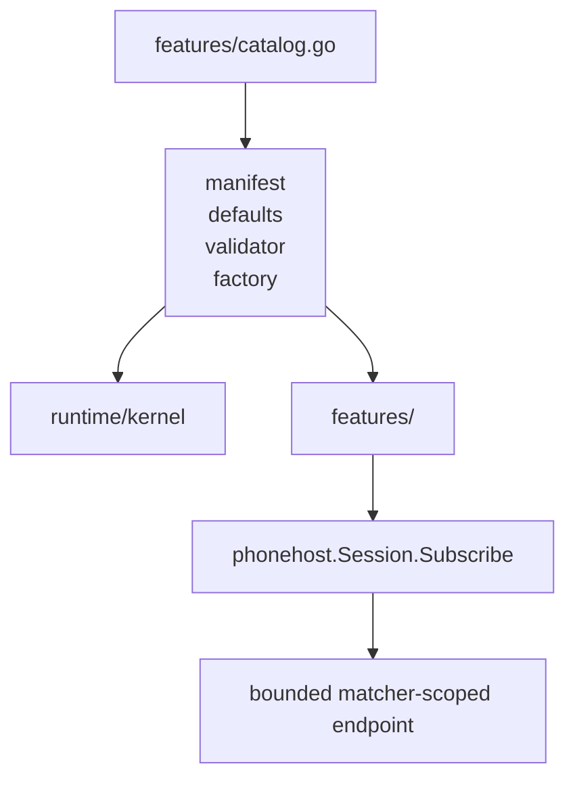
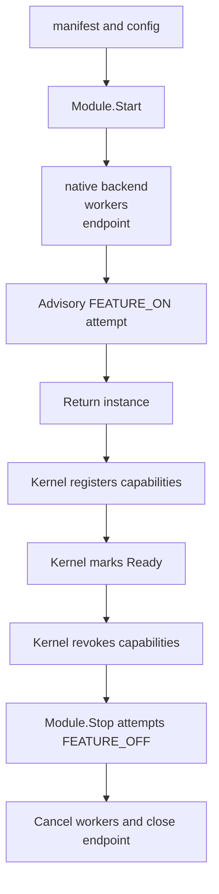

# Feature modules

[Documentation index](../docs/README.md)

Use this page to find the builtin boundary before editing `features/catalog.go` or a feature package. Read the [module architecture](../docs/architecture/modules.md) for lifecycle and dependency rules, the [architecture overview](../docs/architecture/overview.md) for runtime ownership, and the [control-plane contract](../docs/architecture/control-plane.md) for live feature CRUD.

## Current catalog

Each directory under `features/` is a bounded business module. The kernel and phone host expose generic contracts; [`features/catalog.go`](catalog.go) is the build-composition layer that registers builtin implementations. The current catalog contains one module:

```text
phonelink.clipboard
    features/clipboard
    bidirectional text clipboard synchronization
```

The module directory contains a strict [`manifest.json`](clipboard/manifest.json), [`config.schema.json`](clipboard/config.schema.json), Go configuration validation, lifecycle code, protocol and native ownership, and tests. The manifest declares potential capabilities and requested permissions. Permissions are metadata only. The runtime does not sandbox an in-process builtin or treat a declaration as authorization.

## Catalog contract

`Catalog()` builds a `features.Definition` for each builtin. A definition contains:

- the parsed `kernel.Manifest`;
- marshaled default configuration;
- a validator for raw JSON configuration;
- a factory that receives the shared `phonehost.Session` and returns a `kernel.Module`.

The catalog sorts definitions by manifest ID. `Find` resolves only IDs compiled into the catalog. Adding a feature requires one catalog entry and the feature package. Removing a feature removes the entry and package. Kernel lifecycle and phone-host routing must not gain feature-specific branches.

Composition flows from **catalog → definition → kernel and feature package → scoped endpoint**.

<details>
<summary>Composition ownership chart</summary>



</details>

## Clipboard module ownership

`features/clipboard/module.go` is the concrete pattern for a builtin. `New` requires the shared host session and parses the embedded manifest. `Start` validates configuration, detects and reads a native Linux text clipboard, registers a narrow target matcher through `Session.Subscribe`, starts the protocol client and worker queues, sends clipboard `FEATURE_ON`, and returns an instance. The kernel registers its live text capabilities during successful start. Capability registration and the `ready` state are separately synchronized, so a capability-only lookup is not an atomic Ready snapshot, as described in the [module contract](../docs/architecture/modules.md).

The feature owns all clipboard behavior:

- `matcher.go` filters selected-peer PLATFORM traffic for `/DeviceResourceManager`, `/internal/response`, and tag-9 `/Context/Publish` messages;
- `clipboard.Client` handles request IDs, `STATUS`, `CONTENT`, feature state, correlation snapshots, bounded incoming requests, and the shared local and phone generation sequence;
- `sync.go` owns local observation, latest-value publication queues, echo suppression, Wayland nil-clear debounce, and worker shutdown;
- `clipboard/` provides direct `wl-paste` and `wl-copy` execution, X11 fallback through `xclip` or `xsel`, and the Wayland watch helper;
- the module closes its endpoint, cancels its workers, and attempts a short `FEATURE_OFF` synchronization on stop.

A Wayland watch uses `wl-paste --watch` when supported. `poll_interval_ms` is used when watching is unavailable or fails, and for X11. Native commands do not run through a shell. Rapid local updates coalesce in bounded queues. A phone publication advances the same generation domain used for local changes, supersedes older outbound snapshots, and avoids rewriting identical local text. These ownership rules prevent stale CONTENT responses and phone-to-Linux-to-phone echo loops.

The origin barrier suppresses both the previous and incoming normalized text hashes for a three-second remote-write settle window. This is echo tracking, not a filter for secret clipboard content. Clipboard snapshots last two minutes and are bounded to 64 entries. Retired IDs are capped at 256 with no time expiry; duplicate CONTENT requests do not retire an active snapshot, and fallback excludes retired or superseded IDs.

The compatibility command `clipboard-sync` starts this same module through the modular lifecycle. It is an alias, not a second implementation.

## Adding or removing a builtin

Use `features/clipboard` as the complete example. A new builtin supplies its manifest, configuration validator, module implementation, endpoint matcher, resource ownership, and invariant tests before it is added to the catalog.

A module should:

- keep protocol and native domain behavior inside its feature boundary;
- consume relay traffic through `phonehost.Session.Subscribe`, never through `transport/relay.Client.Received()`;
- use the narrowest matcher and a bounded queue with explicit overflow behavior;
- validate configuration before allocating long-lived resources;
- return only genuinely live capabilities;
- stop every goroutine, timer, child process, endpoint, and native watcher it creates;
- make `Stop` idempotent;
- test concurrency, stale work, capability revocation, and consumer-visible error behavior.

The start and stop boundaries are:

| Phase | Ordering |
| --- | --- |
| Start | Validate and open resources, attempt advisory `FEATURE_ON`, then return the instance. |
| Ready | The kernel registers capabilities before marking Ready; these are separately synchronized. |
| Stop | The kernel revokes capabilities before calling `Module.Stop`. The module attempts advisory `FEATURE_OFF`, then cancels workers and closes its endpoint. |

Neither advisory feature-state exchange can make capability revocation wait for an unresponsive phone.

<details>
<summary>Capability and resource lifecycle chart</summary>



</details>

To remove a builtin, disable it and stop any dependents, remove its factory entry from `catalog.go`, then remove the feature package and tests. Stale desired-state records remain generic data. They can be listed, disabled, and deleted, but they cannot be enabled or reconfigured until a matching implementation is compiled in again.
